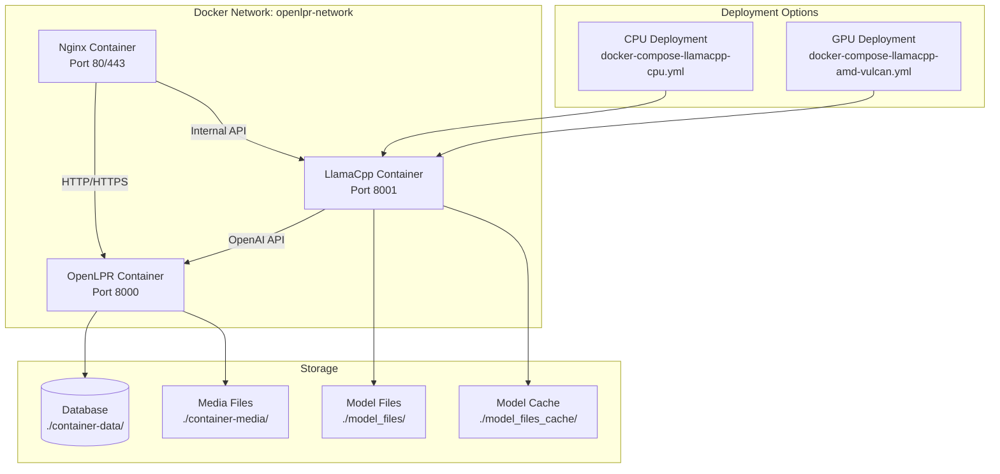

# 🚗 OpenLPR with LlamaCpp - Local Qwen3-VL-4B Inference

This guide provides comprehensive instructions for deploying OpenLPR with a local LlamaCpp inference server running Qwen3-VL-4B model for license plate recognition.

## 🏗️ Architecture Overview

The solution consists of three main components:

1. **LlamaCpp Service** - Inference server running Qwen3-VL-4B (CPU or GPU)
2. **OpenLPR Service** - Django web application for license plate recognition
3. **Nginx Proxy** - Reverse proxy for production deployment (optional)

The LlamaCpp service can run in two modes:
- **CPU Mode**: Uses system CPU cores for inference (universal compatibility)
- **GPU Mode**: Uses AMD GPU with Vulkan for accelerated inference (better performance)

## 🚀 Deployment Options

This project provides two LlamaCpp deployment options:

### 1. AMD Vulkan GPU Version (Recommended)
- **File**: `docker-compose-llamacpp-amd-vulcan.yml`
- **Performance**: Fastest inference with GPU acceleration
- **Prerequisites**: AMD GPU with Vulkan support, ROCm drivers
- **Use Case**: Production deployment with AMD hardware

### 2. CPU Version (Universal Compatibility)
- **File**: `docker-compose-llamacpp-cpu.yml`
- **Performance**: Slower but works on any hardware
- **Prerequisites**: Sufficient RAM (16GB+ recommended)
- **Use Case**: Testing, development, or hardware without GPU support



## 📋 Prerequisites

### System Requirements

#### CPU Deployment
- **CPU**: 4+ cores recommended for optimal performance
- **RAM**: 8GB+ minimum, 16GB+ recommended
- **Storage**: 10GB+ free space for model and cache
- **Docker**: 20.10+ and Docker Compose 2.0+
- **HuggingFace Token**: For accessing gated models (if required)

#### AMD GPU Deployment
- **GPU**: AMD GPU with Vulkan support (RX 6000 series or newer recommended)
- **GPU Memory**: 8GB+ VRAM recommended for optimal performance
- **RAM**: 16GB+ recommended
- **Storage**: 10GB+ free space for model and cache
- **Docker**: 20.10+ and Docker Compose 2.0+
- **ROCm Drivers**: Latest version with Vulkan support
- **HuggingFace Token**: For accessing gated models (if required)

### Software Dependencies

- Docker Engine 20.10+
- Docker Compose 2.0+
- Git (for cloning the repository)

## 🚀 Quick Start

### 1. Clone and Configure

```bash
# Clone the repository
git clone https://github.com/faisalthaheem/open-lpr.git
cd open-lpr

# Copy environment configuration
cp .env.llamacpp.example .env.llamacpp

# Edit the configuration
nano .env.llamacpp
```

### 2. Configure HuggingFace Token

Edit `.env.llamacpp` and set your HuggingFace token:

```env
HF_TOKEN=hf_your_huggingface_token_here
```

Get your token from: https://huggingface.co/settings/tokens

### 3. Choose Deployment Option

#### Option A: AMD Vulkan GPU (Recommended)

```bash
# Create necessary directories
mkdir -p model_files model_files_cache container-data container-media staticfiles

# Start all services with GPU acceleration
docker compose -f docker-compose-llamacpp-amd-vulcan.yml up -d

# View logs
docker compose -f docker-compose-llamacpp-amd-vulcan.yml logs -f

# Check service status
docker compose -f docker-compose-llamacpp-amd-vulcan.yml ps
```

#### Option B: CPU (Universal Compatibility)

```bash
# Create necessary directories
mkdir -p model_files model_files_cache container-data container-media staticfiles

# Start all services with CPU inference
docker compose -f docker-compose-llamacpp-cpu.yml up -d

# View logs
docker compose -f docker-compose-llamacpp-cpu.yml logs -f

# Check service status
docker compose -f docker-compose-llamacpp-cpu.yml ps
```

### 4. Access the Application

- **Web Interface**: http://localhost:8000
- **API Documentation**: http://localhost:8000/api/v1/
- **LlamaCpp API**: http://localhost:8001/v1/
- **Health Check**: http://localhost:8000/health/

## 📁 Project Structure

```
open-lpr/
├── docker-compose-llamacpp-cpu.yml        # CPU-based compose file
├── docker-compose-llamacpp-amd-vulcan.yml # AMD Vulkan GPU compose file
├── .env.llamacpp.example               # Environment configuration template
├── .env.llamacpp                      # Environment configuration
├── scripts/
│   └── download-model.sh               # Model download script
├── nginx/
│   └── nginx.conf                     # Nginx configuration
├── model_files/                       # Model files (created by Docker)
├── model_files_cache/                 # HuggingFace cache (created by Docker)
├── container-data/                    # Database storage
├── container-media/                    # Media files
└── staticfiles/                       # Static files
```

## ⚙️ Configuration

### Environment Variables

Key configuration options in `.env.llamacpp`:

| Variable | Default | Description |
|----------|---------|-------------|
| `HF_TOKEN` | - | HuggingFace access token |
| `MODEL_REPO` | `unsloth/Qwen3-VL-4B-Instruct-GGUF` | Model repository |
| `MODEL_FILE` | `Qwen3-VL-4B-Instruct-Q5_K_M.gguf` | Model filename |
| `MMPROJ_URL` | `https://huggingface.co/unsloth/Qwen3-VL-4B-Instruct-GGUF/resolve/main/mmproj-BF16.gguf` | Multimodal project file URL |
| `N_CTX` | `4096` | Context size |
| `N_THREADS` | `4` | CPU threads for inference |
| `SECRET_KEY` | - | Django secret key |
| `DEBUG` | `False` | Django debug mode |
| `ALLOWED_HOSTS` | `localhost,127.0.0.1,0.0.0.0` | Allowed hosts |

### Model Configuration

The default configuration uses:
- **Model**: Qwen3-VL-4B-Instruct (5-bit quantized)
- **Size**: ~3.3 GB
- **Format**: GGUF (compatible with LlamaCpp)
- **Quantization**: Q5_K_M (balanced quality/size)
- **Repository**: unsloth/Qwen3-VL-4B-Instruct-GGUF
- **Multimodal Project**: mmproj-BF16.gguf (for vision capabilities)

## 🔧 Advanced Configuration

### Custom Model

To use a different model:

1. Update `.env.llamacpp`:
   ```env
   MODEL_REPO=your-repo/your-model
   MODEL_FILE=your-model-file.gguf
   ```

2. Restart services (replace with your compose file):
   ```bash
   docker compose -f docker-compose-llamacpp-cpu.yml down
   docker compose -f docker-compose-llamacpp-cpu.yml up -d
   # or
   docker compose -f docker-compose-llamacpp-amd-vulcan.yml down
   docker compose -f docker-compose-llamacpp-amd-vulcan.yml up -d
   ```

### Performance Tuning

#### CPU Performance

Adjust CPU allocation in `.env.llamacpp`:

```env
# Increase for better performance (more CPU usage)
N_THREADS=8

# Increase for longer context (more RAM usage)
N_CTX=8192

# Adjust batch size
N_BATCH=1024
```

#### GPU Performance (AMD Vulkan)

For GPU deployments, performance is primarily controlled by:
- GPU memory capacity (8GB+ recommended)
- GPU compute units (more is better)
- Vulkan driver version (latest recommended)

Additional GPU-specific settings can be adjusted in the docker-compose file:
```yaml
environment:
  - LLAMA_ARG_DEVICE=vulkan0  # GPU device selection
  - LLAMA_ARG_N_GPU_LAYERS=99  # Number of layers to offload to GPU
```

### Production Deployment

For production deployment with Nginx:

#### CPU Version:
```bash
# Start with Nginx proxy
docker compose -f docker-compose-llamacpp-cpu.yml --profile production up -d

# Configure SSL certificates
mkdir -p nginx/ssl
# Copy your SSL certificates to nginx/ssl/
```

#### AMD Vulkan GPU Version:
```bash
# Start with Nginx proxy
docker compose -f docker-compose-llamacpp-amd-vulcan.yml --profile production up -d

# Configure SSL certificates
mkdir -p nginx/ssl
# Copy your SSL certificates to nginx/ssl/
```

Update `nginx/nginx.conf` for your domain and SSL configuration.

## 📊 Monitoring and Health Checks

### Service Health

```bash
# Check all services (replace with your compose file)
docker-compose -f docker-compose-llamacpp-cpu.yml ps
# or
docker-compose -f docker-compose-llamacpp-amd-vulcan.yml ps

# Check OpenLPR health
curl http://localhost:8000/health/

# Check LlamaCpp health
curl http://localhost:8001/health

# View logs (replace with your compose file)
docker-compose -f docker-compose-llamacpp-cpu.yml logs -f llamacpp
docker-compose -f docker-compose-llamacpp-cpu.yml logs -f lpr-app
# or
docker-compose -f docker-compose-llamacpp-amd-vulcan.yml logs -f llamacpp
docker-compose -f docker-compose-llamacpp-amd-vulcan.yml logs -f lpr-app
```

### Performance Monitoring

Monitor resource usage:

```bash
# Resource usage
docker stats

# Disk usage
df -h
du -sh model_files/ model_files_cache/

# Memory usage
free -h

# GPU monitoring (AMD Vulkan)
docker exec llamacpp rocminfo
# or
docker exec llamacpp radeontop
```

## 🐛 Troubleshooting

### Common Issues

#### 1. Model Download Fails

**Problem**: Model download fails or times out

**Solution**:
```bash
# Check HuggingFace token
echo $HF_TOKEN

# Manual download test (replace with your compose file)
docker-compose -f docker-compose-llamacpp-cpu.yml exec llamacpp /scripts/download-model.sh
# or
docker-compose -f docker-compose-llamacpp-amd-vulcan.yml exec llamacpp /scripts/download-model.sh

# Check available space
df -h
```

#### 2. Service Won't Start

**Problem**: Container fails to start

**Solution**:
```bash
# Check logs (replace with your compose file)
docker-compose -f docker-compose-llamacpp-cpu.yml logs llamacpp
# or
docker-compose -f docker-compose-llamacpp-amd-vulcan.yml logs llamacpp

# Check configuration (replace with your compose file)
docker-compose -f docker-compose-llamacpp-cpu.yml config
# or
docker-compose -f docker-compose-llamacpp-amd-vulcan.yml config

# Verify permissions
ls -la scripts/
chmod +x scripts/download-model.sh
```

#### 3. API Connection Errors

**Problem**: OpenLPR can't connect to LlamaCpp

**Solution**:
```bash
# Check network
docker network ls
docker network inspect openlpr_openlpr-network

# Test connectivity (replace with your compose file)
docker-compose -f docker-compose-llamacpp-cpu.yml exec lpr-app curl http://llamacpp:8000/health
# or
docker-compose -f docker-compose-llamacpp-amd-vulcan.yml exec lpr-app curl http://llamacpp:8000/health

# Check ports
netstat -tlnp | grep :8000
netstat -tlnp | grep :8001
```

#### 4. Memory Issues

**Problem**: Out of memory errors

**Solution**:

For CPU deployment:
```bash
# Reduce context size
N_CTX=2048

# Reduce threads
N_THREADS=2

# Check memory usage
docker stats llamacpp
```

For GPU deployment:
```bash
# Reduce GPU layers offloaded
# Edit docker-compose-llamacpp-amd-vulcan.yml
environment:
  - LLAMA_ARG_N_GPU_LAYERS=20  # Reduce from default 99

# Check GPU memory usage
docker exec llamacpp nvidia-smi  # If nvidia-smi is available
# or
docker exec llamacpp rocminfo  # For AMD GPUs
```

### Debug Mode

Enable debug logging:

```bash
# Set debug mode
echo "DEBUG=True" >> .env.llamacpp

# Restart with verbose logs (replace with your compose file)
docker-compose -f docker-compose-llamacpp-cpu.yml down
docker-compose -f docker-compose-llamacpp-cpu.yml up --build
# or
docker-compose -f docker-compose-llamacpp-amd-vulcan.yml down
docker-compose -f docker-compose-llamacpp-amd-vulcan.yml up --build
```

## 🔄 Maintenance

### Updates

```bash
# Pull latest images (replace with your compose file)
docker-compose -f docker-compose-llamacpp-cpu.yml pull
# or
docker-compose -f docker-compose-llamacpp-amd-vulcan.yml pull

# Restart with updates (replace with your compose file)
docker-compose -f docker-compose-llamacpp-cpu.yml up -d --force-recreate
# or
docker-compose -f docker-compose-llamacpp-amd-vulcan.yml up -d --force-recreate
```

### Backup

```bash
# Backup database (replace with your compose file)
docker-compose -f docker-compose-llamacpp-cpu.yml exec lpr-app cp /app/data/db.sqlite3 /app/data/db.sqlite3.backup
# or
docker-compose -f docker-compose-llamacpp-amd-vulcan.yml exec lpr-app cp /app/data/db.sqlite3 /app/data/db.sqlite3.backup

# Backup media files
tar -czf container-media-backup-$(date +%Y%m%d).tar.gz container-media/

# Backup model cache
tar -czf model_files_cache-backup-$(date +%Y%m%d).tar.gz model_files_cache/
```

### Cleanup

```bash
# Remove unused images
docker image prune -f

# Remove unused volumes
docker volume prune -f

# Clean model cache (redownload required)
rm -rf model_files_cache/*
```

## 📚 API Usage

### OpenLPR API

The OpenLPR API remains unchanged. See `API_DOCUMENTATION.md` for details.

### LlamaCpp API

Direct access to LlamaCpp API (available at http://localhost:8001/v1/ for both CPU and GPU deployments):

```bash
# List models
curl http://localhost:8001/v1/models

# Chat completion
curl -X POST http://localhost:8001/v1/chat/completions \
  -H "Content-Type: application/json" \
  -d '{
    "model": "gpt-4-vision-preview",
    "messages": [
      {
        "role": "user",
        "content": "Hello, how are you?"
      }
    ]
  }'

# Vision completion (with image)
curl -X POST http://localhost:8001/v1/chat/completions \
  -H "Content-Type: application/json" \
  -d '{
    "model": "gpt-4-vision-preview",
    "messages": [
      {
        "role": "user",
        "content": [
          {
            "type": "text",
            "text": "What do you see in this image?"
          },
          {
            "type": "image_url",
            "image_url": {
              "url": "data:image/jpeg;base64,/9j/4AAQSkZJRgABAQAAAQAAAQ..."
            }
          }
        ]
      }
    ]
  }'
```

## 🤝 Contributing

1. Fork the repository
2. Create a feature branch
3. Make your changes
4. Test thoroughly
5. Submit a pull request

## 📄 License

This project is licensed under the MIT License - see the LICENSE file for details.

## 🙏 Acknowledgments

- [Qwen3-VL](https://huggingface.co/unsloth/Qwen3-VL-4B-Instruct-GGUF) for the vision-language model
- [LlamaCpp](https://github.com/ggerganov/llama.cpp) for the inference engine
- [OpenLPR](https://github.com/faisalthaheem/open-lpr) for the license plate recognition system
- [HuggingFace](https://huggingface.co/) for model hosting

---

## 📞 Support

For issues and support:

1. Check this documentation
2. Search existing GitHub issues
3. Create a new issue with:
   - System information
   - Error logs
   - Configuration details
   - Steps to reproduce

**Note**: This setup provides local inference, eliminating dependency on external API services and ensuring data privacy.

## 📚 Additional Resources

For comprehensive documentation and references related to LlamaCpp and ROCm deployment, see:

- [LlamaCpp and ROCm Resources](docs/LLAMACPP_RESOURCES.md) - Collection of important URLs and documentation links
- [Docker Deployment Guide](DOCKER_DEPLOYMENT.md) - General Docker deployment instructions
- [API Documentation](API_DOCUMENTATION.md) - Complete API reference