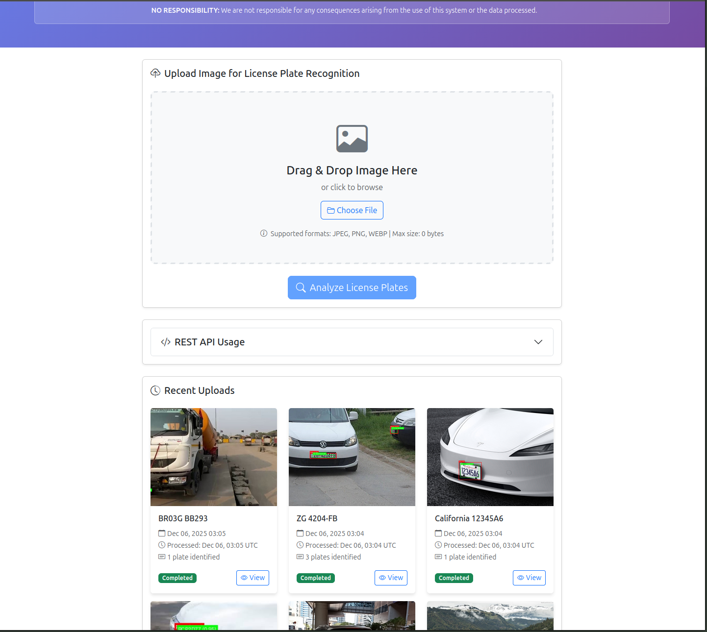
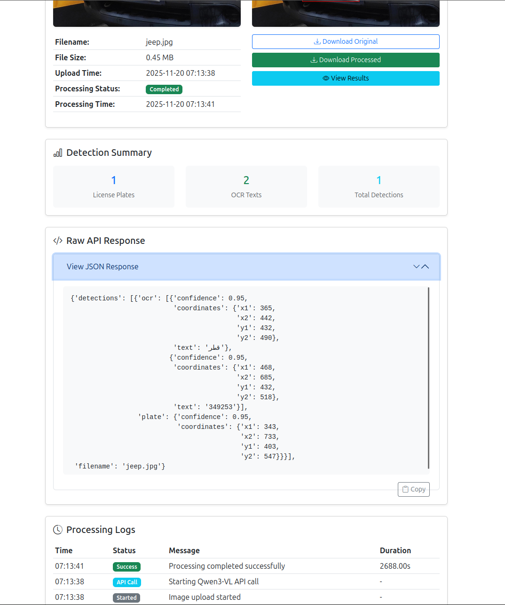
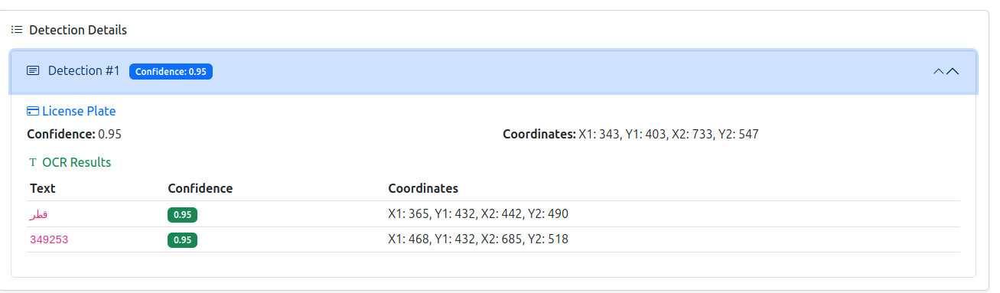
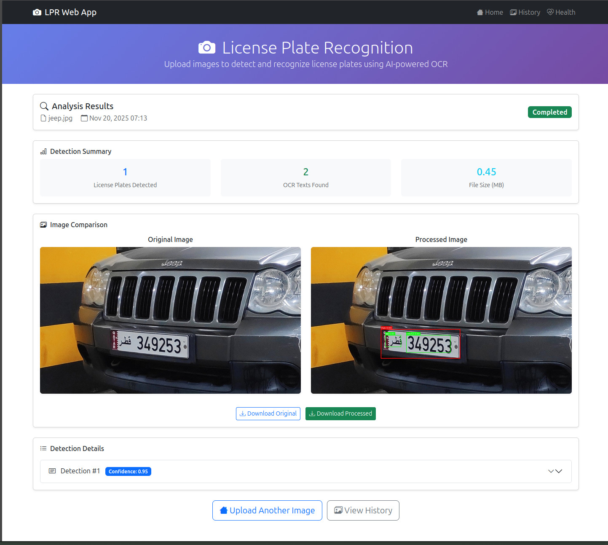

<div align="center">

# 🚗 OPEN LPR - License Plate Recognition System

[](https://github.com/faisalthaheem/open-lpr/releases)
[](https://github.com/faisalthaheem/open-lpr)
[](https://github.com/faisalthaheem/open-lpr)
[](https://github.com/faisalthaheem/open-lpr/issues)
[](https://github.com/faisalthaheem/open-lpr/pkgs/container/open-lpr)
[](https://opensource.org/licenses/Apache-2.0)

*A powerful Django-based web application that uses Qwen3-VL AI model to detect and recognize license plates in images with advanced OCR capabilities.*

> **🚨 Important Stability Notice**: For production deployments, we strongly recommend using **tagged releases** instead of the mainline branch. The mainline may contain experimental features and be under active development. See the [Production Deployment](#-production-deployment) section for guidance on using stable tagged versions.

## 📑 Table of Contents

| | | |
|---|---|---|
| [🚀 Live Demo](#-live-demo) | [🌟 Visual Showcase](#-visual-showcase) | [✨ Features](#-features) |
| [🛠️ Technology Stack](#%EF%B8%8F-technology-stack) | [🚀 Quick Start](#-quick-start) | [⚙️ Configuration](#%EF%B8%8F-configuration) |
| [📖 Usage](#-usage) | [🔌 API Endpoints](#-api-endpoints) | [🐳 Docker Deployment](#-docker-deployment) |
| [📁 File Structure](#-file-structure) | [🧪 Testing](#-testing) | [🔧 Development](#-development) |
| [🚀 Production Deployment](#-production-deployment) | [🐛 Troubleshooting](#-troubleshooting) | [🤝 Contributing](#-contributing) |
| [📄 License](#-license) | [🆘 Support](#-support) | [🙏 Acknowledgments](#-acknowledgments) |
| [📚 Additional Documentation](#-additional-documentation) | | |

</div>

## 🚀 Live Demo

Try the live demo of Open LPR at: **[https://rest-openlpr.computedsynergy.com/](https://rest-openlpr.computedsynergy.com/)**

Experience the license plate recognition system in action without any installation required!


## 🌟 Visual Showcase

| Feature | Preview |
|---------|---------|
| **Main Interface** |  |
| **Detection Results** |  |
| **Detection Details** |  |
| **Processed Image** |  |

## ✨ Features

- 🤖 **AI-Powered Detection**: Uses qwen3-vl-4b-instruct vision-language model for accurate license plate recognition
- 🔍 **Advanced OCR Integration**: Extracts text from detected license plates with confidence scores
- 🎯 **Bounding Box Visualization**: Draws colored boxes around detected plates and OCR text
- 📤 **Drag & Drop Upload**: Modern, user-friendly file upload interface
- 💾 **Permanent Storage**: All uploaded and processed images are saved permanently
- 🔄 **Side-by-Side Comparison**: View original and processed images together
- 🔎 **Search & Filter**: Browse and search through processing history
- 📱 **Responsive Design**: Works on desktop, tablet, and mobile devices
- 🐳 **Docker Support**: Easy deployment with Docker and Docker Compose
- 🔌 **REST API**: Full API for programmatic access


## 🛠️ Technology Stack

<div align="center">

| Backend | AI Model | Frontend | Database | Deployment |
|---------|----------|----------|----------|------------|
|  |  |  |  |  |
|  |  |  |  |  |

</div>

## 🚀 Quick Start

<details>
<summary>Click to expand</summary>

### Docker Deployment (Recommended)

The quickest way to get started is with Docker using the new profile-based compose file, which includes everything needed for local inference without requiring any external API endpoints.

> **🚨 Stability Notice**: For production environments, we strongly recommend using **tagged releases** instead of the mainline branch. See the [Production Deployment](#-production-deployment) section for stable version instructions.

> **🚨 Important Notice**: Individual compose files (`docker-compose-llamacpp-*.yml`) are now deprecated. Please use the new profile-based approach with the main `docker-compose.yml` file.

#### Option 1: AMD Vulkan GPU Version (Fastest Local Inference)
For users with AMD GPUs that support Vulkan:

```bash
# Clone the repository
git clone https://github.com/faisalthaheem/open-lpr.git
cd open-lpr

# Create environment file from template
cp .env.llamacpp.example .env.llamacpp

# Edit the environment file with your settings
nano .env.llamacpp

# Create necessary directories
mkdir -p model_files model_files_cache container-data container-media staticfiles

# Start the application with AMD Vulkan GPU support
docker compose --profile core --profile amd-vulkan up -d

# Check the logs to ensure everything is running correctly
docker compose logs -f
```

#### Option 2: CPU Version (Universal Compatibility)
For users without compatible GPUs or for testing purposes:

```bash
# Clone the repository
git clone https://github.com/faisalthaheem/open-lpr.git
cd open-lpr

# Create environment file from template
cp .env.llamacpp.example .env.llamacpp

# Edit the environment file with your settings
nano .env.llamacpp

# Create necessary directories
mkdir -p model_files model_files_cache container-data container-media staticfiles

# Start the application with CPU support
docker compose --profile core --profile cpu up -d

# Check the logs to ensure everything is running correctly
docker compose logs -f
```

#### Option 3: NVIDIA CUDA GPU Version
For users with NVIDIA GPUs that support CUDA:

```bash
# Clone the repository
git clone https://github.com/faisalthaheem/open-lpr.git
cd open-lpr

# Create environment file from template
cp .env.llamacpp.example .env.llamacpp

# Edit the environment file with your settings
nano .env.llamacpp

# Create necessary directories
mkdir -p model_files model_files_cache container-data container-media staticfiles

# Start the application with NVIDIA CUDA GPU support
docker compose --profile core --profile nvidia-cuda up -d

# Check the logs to ensure everything is running correctly
docker compose logs -f
```

#### Option 4: External API Only
For users who want to use an external OpenAI-compatible API endpoint:

```bash
# Clone the repository
git clone https://github.com/faisalthaheem/open-lpr.git
cd open-lpr

# Create environment file from template
cp .env.example .env

# Edit the environment file with your API settings
nano .env

# Create necessary directories
mkdir -p container-data container-media staticfiles

# Start the application (core services only)
docker compose --profile core up -d

# Check the logs to ensure everything is running correctly
docker compose logs -f
```

### Docker Compose Files

> **🚨 Deprecation Notice**: Individual compose files (`docker-compose-llamacpp-*.yml`) are now deprecated and will be removed in a future release. Please migrate to the new profile-based approach using the main `docker-compose.yml` file.

#### 🆕 Profile-Based Docker Compose (Recommended)

The main `docker-compose.yml` now uses the **merge design pattern** with profiles for flexible deployment:

**Profiles Available:**
- **core**: Core infrastructure (Traefik, OpenLPR, Prometheus, Grafana, Blackbox Exporter, Canary)
- **cpu**: CPU-based LlamaCpp inference
- **amd-vulkan**: AMD Vulkan GPU inference
- **nvidia-cuda**: NVIDIA CUDA GPU inference

**Usage Examples:**
```bash
# Core infrastructure + CPU inference
docker compose --profile core --profile cpu up -d

# Core infrastructure + NVIDIA inference
docker compose --profile core --profile nvidia-cuda up -d

# Core infrastructure + AMD Vulkan inference
docker compose --profile core --profile amd-vulkan up -d

# Core services only (for external API)
docker compose --profile core up -d

# Stop all services
docker compose down
```

**Access Points:**
- **OpenLPR App**: http://lpr.localhost
- **Traefik Dashboard**: http://traefik.localhost
- **Prometheus**: http://prometheus.localhost
- **Grafana**: http://grafana.localhost (admin/admin)
- **Blackbox Exporter**: http://blackbox.localhost
- **Canary Service**: http://canary.localhost

For detailed profile documentation, see [README-DOCKER-PROFILES.md](README-DOCKER-PROFILES.md).

#### Deprecated Individual Compose Files

> **⚠️ Deprecated**: The following compose files are deprecated and will be removed in a future release. Please migrate to the profile-based approach above.

1. **docker-compose-llamacpp-amd-vulcan.yml** (Deprecated)
   - **Replaced by**: `docker compose --profile core --profile amd-vulkan up -d`
   - **Was**: Full local deployment with AMD GPU acceleration using Vulkan

2. **docker-compose-llamacpp-cpu.yml** (Deprecated)
   - **Replaced by**: `docker compose --profile core --profile cpu up -d`
   - **Was**: Full local deployment using CPU for inference

3. **docker-compose.yml** (Legacy external API mode)
   - **Replaced by**: `docker compose --profile core up -d`
   - **Was**: OpenLPR deployment with external API endpoint

### Manual Installation

For development or custom deployments:

1. **Prerequisites**
   - Python 3.8+
   - pip package manager
   - Qwen3-VL API access

2. **Clone the repository**
   
   For **production/stable deployments**, use a tagged release:
   ```bash
   # List available releases
   git ls-remote --tags https://github.com/faisalthaheem/open-lpr.git
   
   # Clone a specific stable version (recommended for production)
   git clone --branch v1.0.0 https://github.com/faisalthaheem/open-lpr.git
   cd open-lpr
   
   # Or clone the latest stable release
   git clone --branch $(git ls-remote --tags https://github.com/faisalthaheem/open-lpr.git | grep -v 'rc\|beta\|alpha' | tail -n1 | sed 's/.*\///') https://github.com/faisalthaheem/open-lpr.git
   cd open-lpr
   ```
   
   For **development/testing** (may be unstable):
   ```bash
   git clone https://github.com/faisalthaheem/open-lpr.git
   cd open-lpr
   ```

3. **Create virtual environment**
   ```bash
   python -m venv venv
   source venv/bin/activate  # On Windows: venv\Scripts\activate
   ```

4. **Install dependencies**
   ```bash
   pip install -r requirements.txt
   ```

5. **Configure environment variables**
   ```bash
   cp .env.example .env
   # Edit .env with your settings
   ```

6. **Set up database**
   ```bash
   python manage.py makemigrations
   python manage.py migrate
   ```

7. **Create superuser (optional)**
   ```bash
   python manage.py createsuperuser
   ```

8. **Run development server**
   ```bash
   python manage.py runserver
   ```

9. **Access the application**
   Open http://127.0.0.1:8000 in your browser

</details>

## ⚙️ Configuration

<details>
<summary>Click to expand</summary>

### Development Environment

For local development (running Django directly):

Create a `.env` file based on `.env.example`:

```env
# Django Settings
SECRET_KEY=your-secret-key-here
DEBUG=True
ALLOWED_HOSTS=localhost,127.0.0.1

# Qwen3-VL API Configuration
QWEN_API_KEY=your-qwen-api-key
QWEN_BASE_URL=https://your-open-api-compatible-endpoint.com/v1
QWEN_MODEL=qwen3-vl-4b-instruct

# File Upload Settings
UPLOAD_FILE_MAX_SIZE=10485760  # 10MB
MAX_BATCH_SIZE=10
```

### Docker Environment with LlamaCpp

For local LlamaCpp inference deployment:

Create a `.env.llamacpp` file based on `.env.llamacpp.example`:

```env
# HuggingFace Token
HF_TOKEN=hf_your_huggingface_token_here

# Model Configuration
MODEL_REPO=unsloth/Qwen3-VL-4B-Instruct-GGUF
MODEL_FILE=Qwen3-VL-4B-Instruct-Q5_K_M.gguf
MMPROJ_URL=https://huggingface.co/unsloth/Qwen3-VL-4B-Instruct-GGUF/resolve/main/mmproj-BF16.gguf

# Django Settings
SECRET_KEY=your-secret-key-here
DEBUG=False
ALLOWED_HOSTS=localhost,127.0.0.1,0.0.0.0

# File Upload Settings
UPLOAD_FILE_MAX_SIZE=10485760  # 10MB
MAX_BATCH_SIZE=10

# Database Configuration
DATABASE_PATH=/app/data/db.sqlite3

# Optional: Superuser creation
DJANGO_SUPERUSER_USERNAME=admin
DJANGO_SUPERUSER_EMAIL=admin@example.com
DJANGO_SUPERUSER_PASSWORD=your-secure-password

# Qwen3-VL API Configuration
QWEN_API_KEY=sk-llamacpp-local
#when using a remote Open API compatible endpoint
# QWEN_BASE_URL=https://your-api-endpoint.io/v1
#When running bundled llamacpp using CPU (default)
QWEN_BASE_URL=http://llamacpp-cpu:8000/v1
#When running bundled llamacpp using AMD GPUs
# QWEN_BASE_URL=http://llamacpp-amd-vulkan:8000/v1
#When running bundled llamacpp using Nvidia GPUs
# QWEN_BASE_URL=http://llamacpp-nvidia-cuda:8000/v1
QWEN_MODEL=Qwen3-VL-4B-Instruct
```

For detailed LlamaCpp deployment instructions, see [README-llamacpp.md](README-llamacpp.md).

</details>

## 📖 Usage

<details>
<summary>Click to expand</summary>

### Uploading Images

1. **Drag & Drop**: Simply drag an image file onto the upload area
2. **Click to Browse**: Click the upload area to select a file
3. **File Validation**:
   - Supported formats: JPEG, PNG, BMP
   - Maximum size: 10MB
4. **Processing**: Click "Analyze License Plates" to start detection

### Viewing Results

After processing, you'll see:

- **Detection Summary**: Number of plates and OCR texts found
- **Image Comparison**: Side-by-side view of original and processed images
- **Detection Details**:
  - License plate coordinates and confidence
  - OCR text results with confidence scores
  - Bounding box coordinates for all detections
- **Download Options**: Download both original and processed images

### Browsing History

Access the "History" page to:
- **Search**: Filter by filename
- **Date Range**: Filter by upload date
- **Status Filter**: View by processing status
- **Pagination**: Navigate through large numbers of uploads

</details>

## 🔌 API Endpoints

<details>
<summary>Click to expand</summary>

### Web Endpoints

- `GET /` - Home page with upload form
- `POST /upload/` - Upload and process image
- `GET /result/<int:image_id>/` - View processing results for a specific image
- `GET /images/` - Browse image history with search and filtering
- `GET /image/<int:image_id>/` - View detailed information about a specific image
- `POST /progress/` - Check processing status (AJAX endpoint)
- `GET /download/<int:image_id>/<str:image_type>/` - Download original or processed images
- `GET /health/` - API health check endpoint

### REST API Endpoints

- `POST /api/v1/ocr/` - Upload an image and receive OCR results synchronously

### Response Format

#### REST API Response Format

The LPR REST API returns JSON in this format:

```json
{
    "success": true,
    "image_id": 123,
    "filename": "example.jpg",
    "processing_time_ms": 2450,
    "results": {
        "detections": [
            {
                "plate_id": "plate1",
                "plate": {
                    "confidence": 0.85,
                    "coordinates": {
                        "x1": 100,
                        "y1": 200,
                        "x2": 250,
                        "y2": 250
                    }
                },
                "ocr": [
                    {
                        "text": "ABC123",
                        "confidence": 0.92,
                        "coordinates": {
                            "x1": 105,
                            "y1": 210,
                            "x2": 245,
                            "y2": 240
                        }
                    }
                ]
            }
        ]
    },
    "summary": {
        "total_plates": 1,
        "total_ocr_texts": 1
    },
    "processing_timestamp": "2023-12-07T15:30:45.123456"
}
```

#### Error Response Format

```json
{
    "success": false,
    "error": "No image file provided",
    "error_code": "MISSING_IMAGE"
}
```

### Usage Examples

#### Python Example

```python
import requests

# API endpoint
url = "http://localhost:8000/api/v1/ocr/"

# Image file to upload
image_path = "license_plate.jpg"

# Read and upload the image
with open(image_path, 'rb') as f:
    files = {'image': f}
    response = requests.post(url, files=files)

# Check response
if response.status_code == 200:
    result = response.json()
    if result['success']:
        print(f"Found {result['summary']['total_plates']} license plates")
        for detection in result['results']['detections']:
            for ocr in detection['ocr']:
                print(f"License plate text: {ocr['text']} (confidence: {ocr['confidence']:.2f})")
    else:
        print(f"Processing failed: {result['error']}")
else:
    print(f"HTTP Error: {response.status_code}")
    print(response.text)
```

#### cURL Example

```bash
# Upload image and get OCR results
curl -X POST \
  -F "image=@license_plate.jpg" \
  http://localhost:8000/api/v1/ocr/
```

</details>

## 🐳 Docker Deployment

<details>
<summary>Click to expand</summary>

The project includes automated Docker image building and publishing to GitHub Container Registry (ghcr.io).

### Using the Pre-built Docker Image

The Docker image is automatically built and published to GitHub Container Registry when code is pushed to the main branch or when tags are created.

> **🚨 Production Recommendation**: For production deployments, always use **versioned tags** instead of `latest`. The `latest` tag may contain unstable features from the mainline branch.

#### Production Deployment (Recommended)

```bash
# Pull a specific stable version (recommended for production)
docker pull ghcr.io/faisalthaheem/open-lpr:v1.0.0

# List available versions
curl -s "https://api.github.com/repos/faisalthaheem/open-lpr/releases" | grep -o '"tag_name": "v[^"]*"' | head -10

# Pull the latest stable release (excluding pre-releases)
LATEST_STABLE=$(curl -s "https://api.github.com/repos/faisalthaheem/open-lpr/releases" | grep -o '"tag_name": "v[^"]*"' | grep -v 'rc\|beta\|alpha' | head -1 | sed 's/"tag_name": "\(.*\)"/\1/')
docker pull ghcr.io/faisalthaheem/open-lpr:$LATEST_STABLE
```

#### Development/Testing (May be unstable)

```bash
# Pull the latest image (mainline, may be unstable)
docker pull ghcr.io/faisalthaheem/open-lpr:latest

# Pull a specific pre-release version
docker pull ghcr.io/faisalthaheem/open-lpr:v1.1.0-beta.1
```

### Docker Compose Deployment

> **🚨 Important**: Individual compose files are now deprecated. Please use the new profile-based approach with the main `docker-compose.yml` file.

This project provides a unified Docker Compose file with profiles for different deployment scenarios. For detailed deployment instructions, see the [Quick Start](#-quick-start) section and [Docker Deployment Guide](DOCKER_DEPLOYMENT.md).

#### Quick Reference

```bash
# Core infrastructure + CPU inference
docker compose --profile core --profile cpu up -d

# Core infrastructure + NVIDIA inference
docker compose --profile core --profile nvidia-cuda up -d

# Core infrastructure + AMD Vulkan inference
docker compose --profile core --profile amd-vulkan up -d

# Core services only (for external API)
docker compose --profile core up -d

# Stop all services
docker compose down
```

#### Environment Configuration

For local inference deployments, copy and configure the environment file:

```bash
# Copy the example environment file
cp .env.llamacpp.example .env.llamacpp

# Edit with your settings
nano .env.llamacpp
```

For external API deployments:

```bash
# Copy the example environment file
cp .env.example .env

# Edit with your API settings
nano .env
```

#### Access Points

After starting the services:

- **OpenLPR Application**: http://lpr.localhost
- **Traefik Dashboard**: http://traefik.localhost
- **Prometheus**: http://prometheus.localhost
- **Grafana**: http://grafana.localhost (admin/admin)
- **Blackbox Exporter**: http://blackbox.localhost
- **Canary Service**: http://canary.localhost

For comprehensive deployment instructions, including production configurations, see [DOCKER_DEPLOYMENT.md](DOCKER_DEPLOYMENT.md) and [README-DOCKER-PROFILES.md](README-DOCKER-PROFILES.md).

### CI/CD Workflow

The project includes a GitHub Actions workflow (`.github/workflows/docker-publish.yml`) that:

1. **Triggers** on:
   - Push to main/master branch
   - Creation of version tags (v*)
   - Pull requests to main/master

2. **Builds** the Docker image for multiple architectures:
   - linux/amd64
   - linux/arm64

3. **Publishes** to GitHub Container Registry with tags:
   - Branch name (e.g., `main`)
   - Semantic version tags (e.g., `v1.0.0`, `v1.0`, `v1`)
   - `latest` tag for the main branch

4. **Generates** SBOM (Software Bill of Materials) for security scanning

</details>

## 📁 File Structure

<details>
<summary>Click to expand</summary>

```
open-lpr/
├── manage.py                    # Django management script
├── requirements.txt              # Python dependencies
├── .env.example                # Environment variables template
├── .env                         # Environment variables (create from .env.example)
├── .env.llamacpp.example       # LlamaCpp environment variables template
├── .env.llamacpp               # LlamaCpp environment variables (create from .env.llamacpp.example)
├── .gitignore                   # Git ignore file
├── .dockerignore               # Docker ignore file
├── API_DOCUMENTATION.md        # Detailed REST API documentation
├── README-DOCKER-PROFILES.md   # Docker profiles guide
├── README-llamacpp.md         # LlamaCpp deployment guide
├── DOCKER_DEPLOYMENT.md        # Docker deployment guide
├── PROMETHEUS_METRICS.md      # Prometheus metrics documentation
├── CHANGELOG.md               # Project changelog
├── LICENSE.md                 # License file
├── test_api.py                 # API testing script
├── test_setup.py               # Test setup utilities
├── test-llamacpp-integration.py # LlamaCpp integration test script
├── test_metrics.py             # Metrics testing script
├── verify-monitoring-setup.sh  # Monitoring setup verification script
├── docker-compose.yml           # Profile-based Docker Compose configuration
├── docker-compose-llamacpp-cpu.yml    # [DEPRECATED] CPU-based LlamaCpp Docker Compose
├── docker-compose-llamacpp-amd-vulcan.yml # [DEPRECATED] AMD Vulkan GPU LlamaCpp Docker Compose
├── docker-entrypoint.sh         # Docker entrypoint script
├── Dockerfile                  # Docker image definition
├── start-llamacpp-cpu.sh     # LlamaCpp CPU startup script
├── build-docker-image.sh      # Docker image build script
├── lpr_project/               # Django project settings
│   ├── __init__.py
│   ├── settings.py             # Django configuration
│   ├── urls.py                 # Project URL patterns
│   └── wsgi.py                 # WSGI configuration
├── lpr_app/                   # Main application
│   ├── __init__.py
│   ├── admin.py                # Django admin configuration
│   ├── apps.py                 # Django app configuration
│   ├── models.py               # Database models
│   ├── views.py                # View functions and API endpoints
│   ├── views_refactored.py     # Refactored view functions
│   ├── urls.py                 # App URL patterns
│   ├── forms.py                # Django forms
│   ├── metrics.py              # Application metrics
│   ├── services/               # Business logic
│   │   ├── __init__.py
│   │   ├── qwen_client.py      # Qwen3-VL API client
│   │   ├── image_processor.py  # Image processing utilities
│   │   ├── bbox_visualizer.py  # Bounding box visualization
│   │   ├── api_service.py      # API service layer
│   │   ├── file_service.py     # File handling service
│   │   └── image_processing_service.py # Image processing service
│   ├── utils/                  # Utility functions
│   │   ├── __init__.py
│   │   ├── metrics_helpers.py  # Metrics helper functions
│   │   ├── response_helpers.py # Response helper functions
│   │   └── validators.py      # Validation utilities
│   ├── views/                 # View modules
│   │   ├── __init__.py
│   │   ├── api_views.py       # API view functions
│   │   ├── file_views.py      # File handling views
│   │   └── web_views.py       # Web interface views
│   ├── management/             # Django management commands
│   │   ├── __init__.py
│   │   └── commands/
│   │       ├── __init__.py
│   │       ├── setup_project.py
│   │       └── inspect_image.py
│   ├── static/                # Static files
│   │   └── lpr_app/
│   │       └── images/
│   │           ├── favicon.ico
│   │           └── favicon.svg
│   └── migrations/            # Database migrations
│       ├── __init__.py
│       └── 0001_initial.py
├── media/                     # Uploaded images
│   ├── uploads/               # Original images
│   └── processed/             # Processed images
├── container-data/             # Docker container data persistence
├── container-media/            # Docker container media persistence
├── staticfiles/               # Collected static files
├── templates/                 # HTML templates
│   ├── base.html              # Base template
│   └── lpr_app/               # App-specific templates
│       ├── base.html
│       ├── image_detail.html
│       ├── image_list.html
│       ├── results.html
│       └── upload.html
├── docs/                      # Documentation
│   ├── LLAMACPP_RESOURCES.md  # LlamaCpp and ROCm resources
│   ├── open-lpr-index.png
│   ├── open-lpr-detection-result.png
│   ├── open-lpr-detection-details.png
│   ├── open-lpr-processed-image.png
│   └── RELEASE_NOTES_v1.0.1.md
├── nginx/                     # Nginx configuration
│   ├── nginx.conf             # Nginx reverse proxy configuration
│   └── ssl/                   # SSL certificates directory
├── traefik/                   # Traefik reverse proxy configuration
│   ├── traefik.yml            # Traefik static configuration
│   ├── dynamic/               # Dynamic configuration directory
│   │   └── config.yml         # Dynamic routing configuration
│   └── ssl/                   # SSL certificates directory
├── prometheus/                # Prometheus monitoring configuration
│   └── prometheus.yml         # Prometheus configuration
├── grafana/                   # Grafana visualization configuration
│   └── provisioning/          # Auto-provisioning configuration
│       ├── datasources/       # Data source configuration
│       │   └── prometheus.yml
│       └── dashboards/        # Dashboard definitions
│           ├── dashboards.yml
│           ├── canary/
│           │   └── lpr-canary-dashboard.json
│           └── default/
│               └── lpr-app-dashboard.json
├── blackbox/                  # Blackbox exporter configuration
│   ├── blackbox.yml           # Blackbox probing configuration
│   └── jeep.jpg              # Test image for blackbox probing
├── canary/                    # Canary service for monitoring
│   ├── canary.py             # Canary service implementation
│   ├── Dockerfile            # Canary service Dockerfile
│   └── jeep.jpg             # Test image for canary service
├── logs/                      # Application logs
├── .github/                  # GitHub workflows
│   └── workflows/             # CI/CD configurations
├── plans/                     # Project planning documents
└── vllm-rocm/                # vLLM ROCm configuration
```

</details>

## 🧪 Testing

<details>
<summary>Click to expand</summary>

Use the provided test script to verify API functionality:

```bash
# Test with default image locations
python test_api.py

# Test with specific image
python test_api.py /path/to/your/image.jpg
```

</details>

## 🔧 Development

<details>
<summary>Click to expand</summary>

### Running Tests

```bash
# Run Django tests
python manage.py test

# Run with coverage
pip install coverage
coverage run --source='.' manage.py test
coverage report
```

### Database Migrations

```bash
# Create new migrations
python manage.py makemigrations lpr_app

# Apply migrations
python manage.py migrate
```

### Static Files

```bash
# Collect static files for production
python manage.py collectstatic --noinput
```

</details>

## 🚀 Production Deployment

<details>
<summary>Click to expand</summary>

> **🚨 Critical Production Requirement**: Always use **tagged releases** for production deployments. The mainline branch may contain experimental features and be unstable. Never use `latest` tags or main branch in production environments.

### Version Selection for Production

#### Option 1: Use Specific Stable Release (Recommended)

```bash
# Find the latest stable release
curl -s "https://api.github.com/repos/faisalthaheem/open-lpr/releases" | grep -o '"tag_name": "v[^"]*"' | grep -v 'rc\|beta\|alpha' | head -1

# Clone a specific stable version
git clone --branch v1.0.0 https://github.com/faisalthaheem/open-lpr.git
cd open-lpr

# Or checkout an existing repository to a stable version
git fetch --tags
git checkout v1.0.0
```

#### Option 2: Use Latest Stable Release

```bash
# Automatically get the latest stable release (excluding pre-releases)
LATEST_STABLE=$(curl -s "https://api.github.com/repos/faisalthaheem/open-lpr/releases" | grep -o '"tag_name": "v[^"]*"' | grep -v 'rc\|beta\|alpha' | head -1 | sed 's/"tag_name": "\(.*\)"/\1/')
git clone --branch $LATEST_STABLE https://github.com/faisalthaheem/open-lpr.git
cd open-lpr
```

#### Option 3: Docker Production Deployment with Versioned Images

```bash
# Use a specific versioned Docker image (recommended)
VERSION=v1.0.0
docker pull ghcr.io/faisalthaheem/open-lpr:$VERSION

# Update your docker-compose.yml to use the versioned image
sed -i "s|ghcr.io/faisalthaheem/open-lpr:latest|ghcr.io/faisalthaheem/open-lpr:$VERSION|g" docker-compose.yml

# Or automatically use the latest stable release
LATEST_STABLE=$(curl -s "https://api.github.com/repos/faisalthaheem/open-lpr/releases" | grep -o '"tag_name": "v[^"]*"' | grep -v 'rc\|beta\|alpha' | head -1 | sed 's/"tag_name": "\(.*\)"/\1/')
docker pull ghcr.io/faisalthaheem/open-lpr:$LATEST_STABLE
```

### Production Settings

1. **Set DEBUG=False** in `.env`
2. **Configure ALLOWED_HOSTS** with your domain
3. **Set up production database** (PostgreSQL recommended)
4. **Configure static file serving** (nginx/AWS S3)
5. **Set up media file serving** (nginx/AWS S3)
6. **Use HTTPS** with SSL certificate
7. **Pin to specific versions** (see version selection above)

### Version Management Strategy

#### Recommended Production Workflow

1. **Select a stable version** (not `latest` or main branch)
2. **Pin both source code and Docker images** to that version
3. **Test thoroughly** in staging environment
4. **Deploy to production** with pinned versions
5. **Monitor for issues** before considering upgrades

#### Version Pinning Examples

**For Source Code:**
```bash
# In your deployment script
VERSION=v1.0.0
git clone --branch $VERSION https://github.com/faisalthaheem/open-lpr.git
```

**For Docker:**
```yaml
# In docker-compose.yml (production)
services:
  openlpr:
    image: ghcr.io/faisalthaheem/open-lpr:v1.0.0  # Pinned version, not latest
    # ... other configuration
```

### Environment-Specific Settings

- **Development**: SQLite database, DEBUG=True, mainline branch acceptable
- **Staging**: PostgreSQL, DEBUG=False, **use same version as production**
- **Production**: PostgreSQL, DEBUG=False, HTTPS required, **always use tagged releases**

### Upgrade Process

1. **Check for new stable releases**:
   ```bash
   curl -s "https://api.github.com/repos/faisalthaheem/open-lpr/releases" | grep -o '"tag_name": "v[^"]*"' | grep -v 'rc\|beta\|alpha' | head -5
   ```

2. **Review release notes** for breaking changes

3. **Test upgrade in staging** with the new version

4. **Backup production data**

5. **Deploy with pinned versions** following the version selection steps above

6. **Monitor and rollback if needed**

⚠️ **Warning**: Never upgrade production systems directly from `latest` tags or mainline branch. Always use specific version tags.

</details>

## 🐛 Troubleshooting

<details>
<summary>Click to expand</summary>

### Common Issues

1. **API Connection Failed**
   - Check QWEN_API_KEY in `.env`
   - Verify QWEN_BASE_URL is accessible
   - Check network connectivity

2. **Image Upload Failed**
   - Verify file format (JPEG/PNG/BMP only)
   - Check file size (< 10MB)
   - Ensure media directory permissions

3. **Processing Errors**
   - Check Django logs: `tail -f django.log`
   - Verify API response format
   - Check image processing dependencies

4. **Static Files Not Loading**
   - Run `python manage.py collectstatic`
   - Check STATIC_URL in settings
   - Verify web server static file configuration

### Logging

Application logs are written to:
- **Development**: Console and `django.log`
- **Production**: Configured logging destination

Log levels:
- `INFO`: General application flow
- `ERROR`: API failures and processing errors
- `DEBUG`: Detailed debugging information

</details>

## 🤝 Contributing

<details>
<summary>Click to expand</summary>

We welcome contributions! Please follow these guidelines:

1. **Fork the repository**
2. **Create a feature branch** (`git checkout -b feature/amazing-feature`)
3. **Make your changes**
4. **Add tests** if applicable
5. **Ensure all tests pass** (`python manage.py test`)
6. **Commit your changes** (`git commit -m 'Add some amazing feature'`)
7. **Push to the branch** (`git push origin feature/amazing-feature`)
8. **Open a Pull Request**

### Code Style

- Follow PEP 8 for Python code
- Use meaningful variable and function names
- Add docstrings to functions and classes
- Keep commits small and focused

### Issue Reporting

When reporting issues, please include:
- Detailed description of the problem
- Steps to reproduce
- Expected vs. actual behavior
- Environment details (OS, Python version, etc.)
- Relevant logs or error messages

</details>

## 📄 License

<details>
<summary>Click to expand</summary>

This project is licensed under the Apache License 2.0 - see the [LICENSE](LICENSE) file for details.

</details>

## 🆘 Support

<details>
<summary>Click to expand</summary>

For issues and questions:
- Check the troubleshooting section
- Review application logs
- Create an issue with detailed information
- Include error messages and steps to reproduce

</details>

## 🙏 Acknowledgments

<details>
<summary>Click to expand</summary>

- [Qwen3-VL](https://github.com/QwenLM/Qwen-VL) for the powerful vision-language model
- [Django](https://www.djangoproject.com/) for the robust web framework
- [Bootstrap](https://getbootstrap.com/) for the responsive UI components
- All contributors who help improve this project

</details>

## 📚 Additional Documentation

<details>
<summary>Click to expand</summary>

For specialized deployment scenarios and additional resources:

- [🆕 Docker Profiles Guide](README-DOCKER-PROFILES.md) - New profile-based Docker Compose setup (Recommended)
- [LlamaCpp and ROCm Resources](docs/LLAMACPP_RESOURCES.md) - Important URLs for local LlamaCpp deployment
- [README-llamacpp.md](README-llamacpp.md) - Local inference with LlamaCpp server
- [Docker Deployment Guide](DOCKER_DEPLOYMENT.md) - Comprehensive Docker deployment instructions
- [API Documentation](API_DOCUMENTATION.md) - Complete REST API reference


---

<div align="center">

**[⬆ Back to top](#-open-lpr---license-plate-recognition-system)**

Made with ❤️ by [Open LPR Team](https://github.com/faisalthaheem/open-lpr)

</div>
