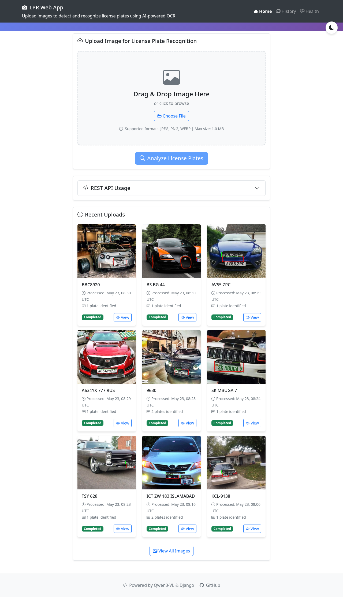
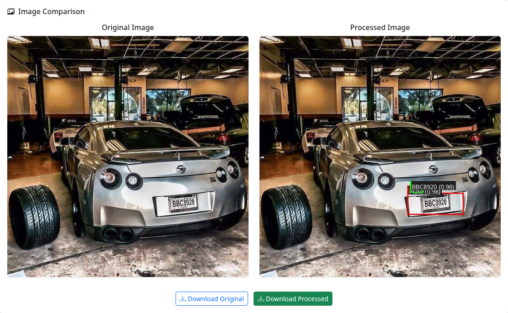
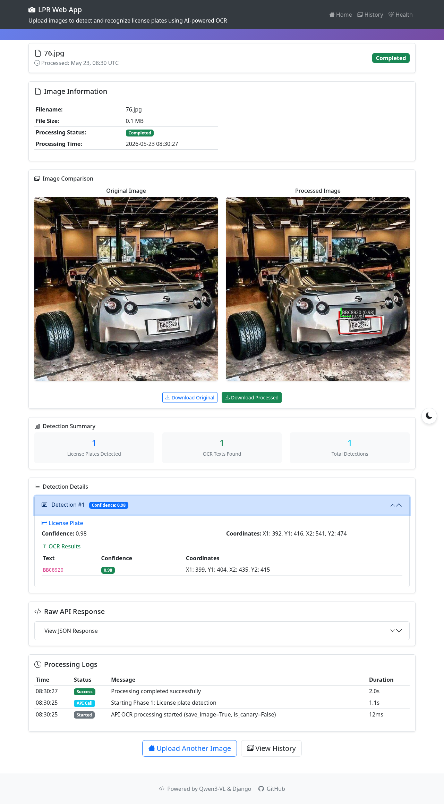
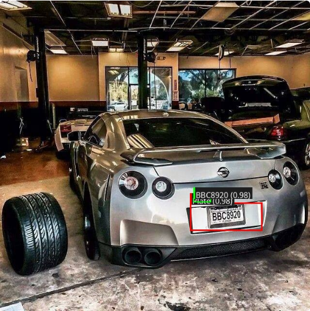

<div align="center">

# 🚗 OPEN LPR - License Plate Recognition System

[](https://github.com/faisalthaheem/open-lpr/releases)
[](https://github.com/faisalthaheem/open-lpr)
[](https://github.com/faisalthaheem/open-lpr)
[](https://github.com/faisalthaheem/open-lpr/issues)
[](https://github.com/faisalthaheem/open-lpr/pkgs/container/open-lpr)
[](https://opensource.org/licenses/Apache-2.0)

*A Django web application with a Next.js SPA frontend that detects and recognises
licence plates in images. Plate detection and text recognition run in-process on
ONNX models by default — no GPU, no external API. A vision-language-model backend
remains available and is selected with one environment variable.*

> **🚨 Important Stability Notice**: For production deployments, we strongly recommend using **tagged releases** instead of the mainline branch. The mainline may contain experimental features and be under active development. See the [Production Deployment](#-production-deployment) section for guidance on using stable tagged versions.

## 📑 Table of Contents

| | | |
|---|---|---|
| [🚀 Live Demo](#-live-demo) | [🌟 Visual Showcase](#-visual-showcase) | [✨ Features](#-features) |
| [🛠️ Technology Stack](#%EF%B8%8F-technology-stack) | [🚀 Quick Start](#-quick-start) | [⚙️ Configuration](#%EF%B8%8F-configuration) |
| [📖 Usage](#-usage) | [🔌 API Endpoints](#-api-endpoints) | [🐳 Docker Deployment](#-docker-deployment) |
| [📁 File Structure](#-file-structure) | [🧪 Testing](#-testing) | [🔧 Development](#-development) |
| [🚀 Production Deployment](#-production-deployment) | [🐛 Troubleshooting](#-troubleshooting) | [🤝 Contributing](#-contributing) |
| [📄 License](#-license) | [🆘 Support](#-support) | [🙏 Acknowledgments](#-acknowledgments) |
| [📚 Additional Documentation](#-additional-documentation) | | |

</div>

## 🚀 Live Demo

Try the live demo of Open LPR at: **[https://openlpr.computedsynergy.com/](https://openlpr.computedsynergy.com/)**

Experience the license plate recognition system in action without any installation required!


## 🌟 Visual Showcase

| Feature | Preview |
|---------|---------|
| **Upload Interface** |  |
| **Detection Results** |  |
| **Detection Details** |  |
| **Processed Image** |  |

## ✨ Features

- 🤖 **In-Process Detection**: YOLOX-tiny plate detector running on ONNX Runtime — ~60ms per image on CPU, no GPU and no external API call
- 🔍 **On-Device OCR**: PP-OCRv5 CTC recogniser reads plate text with confidence scores; CPU inference needs only `onnxruntime`
- 🔁 **Configurable Backend**: `PIPELINE_BACKEND=llm` switches to a Qwen3-VL vision-language model via any OpenAI-compatible endpoint. Rolling back is one environment variable — no migration, no data rewrite
- 📏 **Latency Instrumented**: Per-stage and end-to-end durations export as Prometheus histograms against a 0.5s budget
- 🎯 **Bounding Box Visualization**: Draws colored boxes around detected plates and OCR text
- 📤 **Drag & Drop Upload**: Modern, user-friendly file upload interface
- 💾 **Permanent Storage**: All uploaded and processed images are saved permanently
- 🔄 **Side-by-Side Comparison**: View original and processed images together
- 🔎 **Search & Filter**: Browse and search through processing history
- 📱 **Responsive Design**: Works on desktop, tablet, and mobile devices
- 🌙 **Dark Mode**: Full light/dark theme support with system preference detection
- 🐳 **Docker Support**: Easy deployment with Docker and Docker Compose
- 🔌 **REST API**: Full API for programmatic access
- ⚛️ **Next.js SPA**: Modern React-based single-page application with Tailwind CSS
- 📖 **Storybook**: Component development environment with stories for all UI components


## 🛠️ Technology Stack

<div align="center">

| Backend | Inference | Frontend | Database | Deployment |
|---------|-----------|----------|----------|------------|
|  |  |  |  |  |
|  |  |  |  |  |

Inference runs locally by default. The vision-language-model path
(Qwen3-VL or any OpenAI-compatible endpoint) is still supported via
`PIPELINE_BACKEND=llm`.

</div>

## 🚀 Quick Start

<details>
<summary>Click to expand</summary>

### Model Artifacts

`PIPELINE_BACKEND` defaults to `local`, which needs three ONNX artifacts
(~37MB total). **Under Docker you do not fetch these yourself** —
`docker-entrypoint.sh` downloads and checksum-verifies them on first boot:

```
INFO fetch_artifacts plate_yolox_tiny_640.onnx downloaded and verified (20183226 bytes)
INFO fetch_artifacts Local pipeline artifacts verified in /app/model/plate
```

Mount `./model/plate` as a **persistent volume**. Without one the directory
lives in the container's writable layer, is discarded on every container
replacement, and the download repeats on each redeploy — which also means a
transient network failure at that moment fails an otherwise-healthy deploy.

Artifacts are pinned to a tag (`PIPELINE_MODEL_REVISION`, default
`detector-2026.10.1`), so a given deployment version resolves to the same bytes
on every future redeploy. Bumping the revision is an explicit act rather than a
side effect of someone re-uploading to the weights repository's main branch.

For a non-Docker run, or to pre-populate the directory:

```bash
mkdir -p model/plate
python lpr_app/pipeline/fetch_artifacts.py --model-dir model/plate
```

Set `PIPELINE_MODEL_DOWNLOAD=false` for airgapped installs that populate
`PIPELINE_MODEL_DIR` from elsewhere (a bake step, an internal mirror, a bind
mount). The presence check still runs, so a misconfigured deployment fails at
startup with a clear message rather than at inference time.

> The recogniser and its dictionary are **a set**. Decoding assumes
> `len(dict) + 2` output classes, so substituting one without the other yields
> silently wrong text rather than an error. Provenance and licences are
> documented in the [weights repository](https://huggingface.co/faisalthaheem/open-lpr-models).

### Docker Deployment (Recommended)

The quickest way to get started is with Docker using the profile-based compose
file.

> **🚨 Stability Notice**: For production environments, we strongly recommend using **tagged releases** instead of the mainline branch. See the [Production Deployment](#-production-deployment) section for stable version instructions.

> **🚨 Important Notice**: The individual `docker-compose-llamacpp-*.yml` files have been removed. Use the profile-based approach with `docker-compose.yaml`.

#### Option 1: CPU Only (Default, No GPU Required)

The default backend needs no GPU profile at all — inference is on-CPU inside the
app container. The `cpu`/`amd-vulkan`/`nvidia-cuda` profiles below exist only for
the optional `PIPELINE_BACKEND=llm` path:

```bash
git clone https://github.com/faisalthaheem/open-lpr.git
cd open-lpr

mkdir -p container-data container-media staticfiles model/plate

docker compose --profile core up -d
docker compose logs -f
```

The artifacts (~37MB) download on first boot. `model/plate` is already mounted
by `docker-compose.yaml`, so keeping it on the host means subsequent redeploys
reuse them.

#### Option 2: LLM Backend on AMD Vulkan GPU
Rollback path only. Use this to serve inference from a VLM instead of the default
in-process ONNX models, which requires `PIPELINE_BACKEND=llm`. On-CPU local
inference needs no GPU profile and no LlamaCpp — see Option 1.

```bash
# Clone the repository
git clone https://github.com/faisalthaheem/open-lpr.git
cd open-lpr

# Create environment file from template
cp .env.llamacpp.example .env.llamacpp

# Edit the environment file with your settings
nano .env.llamacpp

# Create necessary directories
mkdir -p model_files model_files_cache container-data container-media staticfiles

# LLM backend on AMD Vulkan GPU
docker compose --profile core --profile amd-vulkan up -d

# Check the logs to ensure everything is running correctly
docker compose logs -f
```

#### Option 3: LLM Backend on CPU (Universal Compatibility)
Rollback path only. Use this to serve inference from a VLM instead of the default
in-process ONNX models, which requires `PIPELINE_BACKEND=llm`.

```bash
# Clone the repository
git clone https://github.com/faisalthaheem/open-lpr.git
cd open-lpr

# Create environment file from template
cp .env.llamacpp.example .env.llamacpp

# Edit the environment file with your settings
nano .env.llamacpp

# Create necessary directories
mkdir -p model_files model_files_cache container-data container-media staticfiles

# LLM backend on CPU
docker compose --profile core --profile cpu up -d

# Check the logs to ensure everything is running correctly
docker compose logs -f
```

#### Option 4: LLM Backend on NVIDIA CUDA GPU
Rollback path only. Use this to serve inference from a VLM instead of the default
in-process ONNX models, which requires `PIPELINE_BACKEND=llm`. On-CPU local
inference needs no GPU profile and no LlamaCpp — see Option 1.

```bash
# Clone the repository
git clone https://github.com/faisalthaheem/open-lpr.git
cd open-lpr

# Create environment file from template
cp .env.llamacpp.example .env.llamacpp

# Edit the environment file with your settings
nano .env.llamacpp

# Create necessary directories
mkdir -p model_files model_files_cache container-data container-media staticfiles

# LLM backend on NVIDIA CUDA GPU
docker compose --profile core --profile nvidia-cuda up -d

# Check the logs to ensure everything is running correctly
docker compose logs -f
```

#### Option 5: LLM Backend via External API
Rollback path only. Use `PIPELINE_BACKEND=llm` to serve inference from an external
OpenAI-compatible API endpoint rather than the default in-process ONNX models.
Uses the same `core` profile as Option 1 — no inference container either way, only
the backend differs.

```bash
# Clone the repository
git clone https://github.com/faisalthaheem/open-lpr.git
cd open-lpr

# Create environment file from template
cp .env.example .env

# Edit the environment file with your API settings
nano .env

# Create necessary directories
mkdir -p container-data container-media staticfiles

# Start the application (core services only)
docker compose --profile core up -d

# Check the logs to ensure everything is running correctly
docker compose logs -f
```

### Docker Compose Files

> **🚨 Removal Notice**: The individual `docker-compose-llamacpp-*.yml` files have been removed. Use the profile-based approach with `docker-compose.yaml`.

#### 🆕 Profile-Based Docker Compose (Recommended)

The main `docker-compose.yml` now uses the **merge design pattern** with profiles for flexible deployment:

**Profiles Available:**
- **core**: Core infrastructure (OpenLPR, SPA, Prometheus, Grafana, Blackbox Exporter, Canary). This alone is a complete deployment — the default backend runs inference inside the app container
- **cpu**: LLM inference on CPU via LlamaCpp (only for `PIPELINE_BACKEND=llm`)
- **amd-vulkan**: LLM inference on AMD Vulkan GPU via LlamaCpp (only for `PIPELINE_BACKEND=llm`)
- **nvidia-cuda**: LLM inference on NVIDIA GPU via LlamaCpp (only for `PIPELINE_BACKEND=llm`)

Note that "CPU inference" is ambiguous here and worth being precise about: the
default backend already infers on CPU inside the app container and needs no
profile at all. The `cpu` profile means the *LLM* backend served by LlamaCpp.

**Usage Examples:**
```bash
# Default: local ONNX inference in-process, no GPU and no LlamaCpp
docker compose --profile core up -d

# Rollback: LLM backend on CPU
docker compose --profile core --profile cpu up -d

# Rollback: LLM backend on NVIDIA
docker compose --profile core --profile nvidia-cuda up -d

# Rollback: LLM backend on AMD Vulkan
docker compose --profile core --profile amd-vulkan up -d

# Stop all services
docker compose down
```

**Access Points:**
- **OpenLPR App**: http://lpr.localhost
- **Traefik Dashboard**: http://traefik.localhost
- **Prometheus**: http://prometheus.localhost
- **Grafana**: http://grafana.localhost (admin/admin)
- **Blackbox Exporter**: http://blackbox.localhost
- **Canary Service**: http://canary.localhost

For detailed profile documentation, see [Docker Profiles Guide](docs/DOCKER_PROFILES.md).

#### Removed Individual Compose Files

> **⚠️ Removed**: `docker-compose-llamacpp-amd-vulcan.yml` and `docker-compose-llamacpp-cpu.yml` have been deleted. Use the profile-based commands above.

| Removed file | Replacement command | Previous behaviour |
| --- | --- | --- |
| `docker-compose-llamacpp-amd-vulcan.yml` | `docker compose --profile core --profile amd-vulkan up -d` | LLM backend on AMD GPU acceleration via Vulkan |
| `docker-compose-llamacpp-cpu.yml` | `docker compose --profile core --profile cpu up -d` | LLM backend using CPU for inference |

### Manual Installation

For development or custom deployments:

1. **Prerequisites**
   - Python 3.10+
   - pip package manager
   - *Only* for a non-Docker run: the ONNX artifacts (see [Model Artifacts](#model-artifacts))
   - *Only* for `PIPELINE_BACKEND=llm`: access to a Qwen3-VL or other OpenAI-compatible endpoint

2. **Clone the repository**
   
   For **production/stable deployments**, use a tagged release:
   ```bash
   # List available releases
   git ls-remote --tags https://github.com/faisalthaheem/open-lpr.git
   
   # Clone a specific stable version (recommended for production)
   git clone --branch v1.0.0 https://github.com/faisalthaheem/open-lpr.git
   cd open-lpr
   
   # Or clone the latest stable release
   git clone --branch $(git ls-remote --tags https://github.com/faisalthaheem/open-lpr.git | grep -v 'rc\|beta\|alpha' | tail -n1 | sed 's/.*\///') https://github.com/faisalthaheem/open-lpr.git
   cd open-lpr
   ```
   
   For **development/testing** (may be unstable):
   ```bash
   git clone https://github.com/faisalthaheem/open-lpr.git
   cd open-lpr
   ```

3. **Create virtual environment**
   ```bash
   python -m venv venv
   source venv/bin/activate  # On Windows: venv\Scripts\activate
   ```

4. **Install dependencies**
   ```bash
   pip install -r requirements.txt
   ```

5. **Fetch the model artifacts** (not needed when using Docker, which does this
   on first boot)
   ```bash
   mkdir -p model/plate
   python lpr_app/pipeline/fetch_artifacts.py --model-dir model/plate
   ```

6. **Configure environment variables**
   ```bash
   cp .env.example .env
   # Edit .env with your settings.
   # The default backend needs no API key; QWEN_* is only read by PIPELINE_BACKEND=llm.
   ```

7. **Set up database**
   ```bash
   python manage.py makemigrations
   python manage.py migrate
   ```

8. **Create superuser (optional)**
   ```bash
   python manage.py createsuperuser
   ```

9. **Run development server**
   ```bash
   python manage.py runserver
   ```

10. **Access the application**
   Open http://127.0.0.1:8000 in your browser

</details>

## ⚙️ Configuration

<details>
<summary>Click to expand</summary>

### Development Environment

For local development (running Django directly):

Create a `.env` file based on `.env.example`:

```env
# Django Settings
SECRET_KEY=your-secret-key-here
DEBUG=True
ALLOWED_HOSTS=localhost,127.0.0.1

# Inference backend: local (default, in-process ONNX) or llm (external API).
# 'local' requires the artifacts under PIPELINE_MODEL_DIR. Nothing else here is
# needed for the default path -- no API key, no GPU.
PIPELINE_BACKEND=local

# File Upload Settings
UPLOAD_FILE_MAX_SIZE=10485760  # 10MB
MAX_BATCH_SIZE=10
```

### Pipeline Settings

The local backend is configured entirely by environment variables. The defaults
are tuned for this project; the full annotated list with rationale is in
[`.env.example`](.env.example) and [AGENTS.md](AGENTS.md).

| Variable | Default | Notes |
|---|---|---|
| `PIPELINE_BACKEND` | `local` | `local` or `llm`. Artifacts are **required** when `local`; a missing one raises rather than silently returning zero plates |
| `PIPELINE_MODEL_DIR` | `model/plate` | Where artifacts are resolved from |
| `PIPELINE_MODEL_DOWNLOAD` | `true` | Docker only. Fetch artifacts on first boot. `false` for airgapped installs |
| `PIPELINE_MODEL_REVISION` | `detector-2026.10.1` | Pinned tag in the weights repo, so a deployment version resolves to the same bytes on every redeploy |
| `PIPELINE_MODEL_REPO` | `faisalthaheem/open-lpr-models` | |
| `PIPELINE_DETECTOR_MODEL` | `plate_yolox_tiny_640.onnx` | |
| `PIPELINE_DETECTOR_INPUT_SIZE` | `640,640` | Recall-critical, not a speed knob — the corpus 10th-percentile plate is 36px tall, which only stays resolvable at 640 |
| `PIPELINE_DETECTOR_CONF_THRESHOLD` | `0.3` | |
| `PIPELINE_DETECTOR_NMS_IOU` | `0.45` | |
| `PIPELINE_LAYOUT_THRESHOLD` | `2.0` | Aspect ratio separating stacked from single-line plates |
| `PIPELINE_OCR_MODEL` | `plate_ocr_ppocrv5_mobile.onnx` | |
| `PIPELINE_OCR_DICT` | `plate_ocr_dict.json` | Must match the recogniser export |
| `PIPELINE_OCR_BATCH_SIZE` | `8` | Crops per inference |
| `PIPELINE_OCR_CHARSET_PROFILE` | `alphanumeric` | `alphanumeric` or `no_io` |
| `PIPELINE_OCR_SPLIT_STACKED` | `False` | Off by default; see below |
| `PIPELINE_RECTIFY_ENABLED` | `True` | When false, `OCR_CROP_PADDING_PX` applies instead |
| `PIPELINE_PROVIDER` | `cpu` | `cpu`, `cuda`, `rocm`. An unavailable provider falls back to CPU with a logged warning. ROCm is never required |
| `PIPELINE_LATENCY_BUDGET_SECONDS` | `0.5` | The sub-500ms target |
| `PIPELINE_STAGE_BUDGETS` | empty | `stage=seconds` pairs, e.g. `detect_plate=0.4` |

### Upload Limits

| Variable | Default | Notes |
|---|---|---|
| `UPLOAD_FILE_MAX_SIZE` | `1048576` | Bytes on disk |
| `UPLOAD_IMAGE_MAX_PIXELS` | `40000000` | Decoded pixels, read from the header before decompression. `0` disables |

The two are not interchangeable. A flat-colour PNG compresses by roughly 3000:1,
so a 0.4MB upload can declare 144 megapixels and cost 430MB of RAM once decoded —
which is what makes the size limit insufficient on its own against a
decompression bomb. Pillow's built-in guard warns below 178 megapixels rather
than rejecting, so it does not cover this case.

40 megapixels accepts a 12MP phone photo with room to spare. The detector
letterboxes to 640×640 regardless, so input resolution beyond this point costs
memory without buying accuracy.

**Switching backends.** Both produce an identical detections structure, so no
API response, caller, visualizer, or metric branches on which one ran. Rolling
back is `PIPELINE_BACKEND=llm` and a redeploy — no migration, no data rewrite.

**Two limitations worth knowing before tuning.**

*Stacked-plate row splitting is off by default, deliberately.* Aspect ratio
cannot distinguish a two-line plate from a single-line plate carrying a caption:
both span ratios 1.4–2.4, both have an ink gap, both split unevenly. The split
read scores *higher* confidence while being wrong. Enable
`PIPELINE_OCR_SPLIT_STACKED=true` only for regions known to be uniformly
stacked.

*Higher coverage is not higher accuracy.* On a 20-plate hand-transcribed pilot
the local backend scores CER 0.367 / exact-match 0.35 — it reads nearly every
plate it detects and gets roughly a third exactly right. That pilot is small,
was not randomly ordered, and the LLM arm was not scored on the same plates, so
it is not a comparison. See
[`openspec/changes/measure-local-backend-accuracy/COMPARISON.md`](openspec/changes/measure-local-backend-accuracy/COMPARISON.md).

### Vision-Language-Model Backend (optional)

Only used when `PIPELINE_BACKEND=llm`. Any OpenAI-compatible endpoint works —
a hosted API, vLLM, or the bundled LlamaCpp services.

For a plain external endpoint, set these in `.env`:

```env
PIPELINE_BACKEND=llm
QWEN_API_KEY=your-api-key
QWEN_BASE_URL=https://your-open-api-compatible-endpoint.com/v1
QWEN_MODEL=your-model-name
```

To run the bundled LlamaCpp service instead, create a `.env.llamacpp` file based
on `.env.llamacpp.example`:

```env
# HuggingFace Token
HF_TOKEN=hf_your_huggingface_token_here

# Model Configuration
MODEL_REPO=unsloth/Qwen3-VL-4B-Instruct-GGUF
MODEL_FILE=Qwen3-VL-4B-Instruct-Q5_K_M.gguf
MMPROJ_URL=https://huggingface.co/unsloth/Qwen3-VL-4B-Instruct-GGUF/resolve/main/mmproj-BF16.gguf

# Django Settings
SECRET_KEY=your-secret-key-here
DEBUG=False
ALLOWED_HOSTS=localhost,127.0.0.1,0.0.0.0

# File Upload Settings
UPLOAD_FILE_MAX_SIZE=10485760  # 10MB
MAX_BATCH_SIZE=10

# Database Configuration
DATABASE_PATH=/app/data/db.sqlite3

# Optional: Superuser creation
DJANGO_SUPERUSER_USERNAME=admin
DJANGO_SUPERUSER_EMAIL=admin@example.com
DJANGO_SUPERUSER_PASSWORD=your-secure-password

# Qwen3-VL API Configuration
QWEN_API_KEY=sk-llamacpp-local
#when using a remote Open API compatible endpoint
# QWEN_BASE_URL=https://your-api-endpoint.io/v1
#When running bundled llamacpp using CPU (default)
QWEN_BASE_URL=http://llamacpp-cpu:8000/v1
#When running bundled llamacpp using AMD GPUs
# QWEN_BASE_URL=http://llamacpp-amd-vulkan:8000/v1
#When running bundled llamacpp using Nvidia GPUs
# QWEN_BASE_URL=http://llamacpp-nvidia-cuda:8000/v1
QWEN_MODEL=Qwen3-VL-4B-Instruct
```

For detailed LlamaCpp deployment instructions, see [LlamaCpp Deployment Guide](docs/LLAMACPP.md).

</details>

## 📖 Usage

<details>
<summary>Click to expand</summary>

### Uploading Images

1. **Drag & Drop**: Simply drag an image file onto the upload area
2. **Click to Browse**: Click the upload area to select a file
3. **File Validation**:
   - Supported formats: JPEG, PNG, WEBP
   - Maximum size: configurable (default 1MB dev / 10MB Docker)
4. **Processing**: Click "Analyze License Plates" to start detection

### Viewing Results

After processing, you'll see:

- **Detection Summary**: Number of plates and OCR texts found
- **Image Comparison**: Side-by-side view of original and processed images
- **Detection Details**:
  - License plate coordinates and confidence
  - OCR text results with confidence scores
  - Bounding box coordinates for all detections
- **Download Options**: Download both original and processed images

### Browsing History

Access the "History" page to:
- **Search**: Filter by filename
- **Date Range**: Filter by upload date
- **Status Filter**: View by processing status
- **Pagination**: Navigate through large numbers of uploads

</details>

## 🔌 API Endpoints

<details>
<summary>Click to expand</summary>

### REST API Endpoints

- `POST /api/v1/ocr/` - Upload an image and receive OCR results synchronously
- `GET /api/v1/images/` - List images with pagination and filtering
- `GET /api/v1/images/<int:image_id>/` - Get detailed information about a specific image
- `GET /api/v1/download/<int:image_id>/<str:image_type>/` - Download original or processed images
- `GET /api/v1/config/` - Get application configuration (max upload size, timeout)
- `GET /metrics/` - Prometheus metrics endpoint

### Response Format

#### REST API Response Format

The LPR REST API returns JSON in this format:

```json
{
    "success": true,
    "image_id": 123,
    "filename": "example.jpg",
    "processing_time_ms": 2450,
    "results": {
        "detections": [
            {
                "plate_id": "plate1",
                "plate": {
                    "confidence": 0.85,
                    "coordinates": {
                        "x1": 100,
                        "y1": 200,
                        "x2": 250,
                        "y2": 250
                    }
                },
                "ocr": [
                    {
                        "text": "ABC123",
                        "confidence": 0.92,
                        "coordinates": {
                            "x1": 105,
                            "y1": 210,
                            "x2": 245,
                            "y2": 240
                        }
                    }
                ]
            }
        ]
    },
    "summary": {
        "total_plates": 1,
        "total_ocr_texts": 1
    },
    "processing_timestamp": "2023-12-07T15:30:45.123456"
}
```

#### Error Response Format

```json
{
    "success": false,
    "error": "No image file provided",
    "error_code": "MISSING_IMAGE"
}
```

### Usage Examples

#### Python Example

```python
import requests

# API endpoint
url = "http://localhost:8000/api/v1/ocr/"

# Image file to upload
image_path = "license_plate.jpg"

# Read and upload the image
with open(image_path, 'rb') as f:
    files = {'image': f}
    response = requests.post(url, files=files)

# Check response
if response.status_code == 200:
    result = response.json()
    if result['success']:
        print(f"Found {result['summary']['total_plates']} license plates")
        for detection in result['results']['detections']:
            for ocr in detection['ocr']:
                print(f"License plate text: {ocr['text']} (confidence: {ocr['confidence']:.2f})")
    else:
        print(f"Processing failed: {result['error']}")
else:
    print(f"HTTP Error: {response.status_code}")
    print(response.text)
```

#### cURL Example

```bash
# Upload image and get OCR results
curl -X POST \
  -F "image=@license_plate.jpg" \
  http://localhost:8000/api/v1/ocr/
```

</details>

## 🐳 Docker Deployment

<details>
<summary>Click to expand</summary>

The project includes automated Docker image building and publishing to GitHub Container Registry (ghcr.io).

### Using the Pre-built Docker Image

The Docker image is automatically built and published to GitHub Container Registry when code is pushed to the main branch or when tags are created.

> **🚨 Production Recommendation**: For production deployments, always use **versioned tags** instead of `latest`. The `latest` tag may contain unstable features from the mainline branch.

#### Production Deployment (Recommended)

```bash
# Pull a specific stable version (recommended for production)
docker pull ghcr.io/faisalthaheem/open-lpr:v1.0.0

# List available versions
curl -s "https://api.github.com/repos/faisalthaheem/open-lpr/releases" | grep -o '"tag_name": "v[^"]*"' | head -10

# Pull the latest stable release (excluding pre-releases)
LATEST_STABLE=$(curl -s "https://api.github.com/repos/faisalthaheem/open-lpr/releases" | grep -o '"tag_name": "v[^"]*"' | grep -v 'rc\|beta\|alpha' | head -1 | sed 's/"tag_name": "\(.*\)"/\1/')
docker pull ghcr.io/faisalthaheem/open-lpr:$LATEST_STABLE
```

#### Development/Testing (May be unstable)

```bash
# Pull the latest image (mainline, may be unstable)
docker pull ghcr.io/faisalthaheem/open-lpr:latest

# Pull a specific pre-release version
docker pull ghcr.io/faisalthaheem/open-lpr:v1.1.0-beta.1
```

### Docker Compose Deployment

> **🚨 Important**: Individual compose files are now deprecated. Please use the new profile-based approach with the main `docker-compose.yml` file.

This project provides a unified Docker Compose file with profiles for different deployment scenarios. For detailed deployment instructions, see the [Quick Start](#-quick-start) section and [Docker Deployment Guide](DOCKER_DEPLOYMENT.md).

#### Quick Reference

```bash
# Default: local ONNX inference in-process, no GPU and no LlamaCpp
docker compose --profile core up -d

# Rollback: LLM backend on CPU
docker compose --profile core --profile cpu up -d

# Rollback: LLM backend on NVIDIA
docker compose --profile core --profile nvidia-cuda up -d

# Rollback: LLM backend on AMD Vulkan
docker compose --profile core --profile amd-vulkan up -d

# Rollback: LLM backend via external API
docker compose --profile core up -d

# Stop all services
docker compose down
```

#### Environment Configuration

For LLM-backend deployments via LlamaCpp, copy and configure the environment file:

```bash
# Copy the example environment file
cp .env.llamacpp.example .env.llamacpp

# Edit with your settings
nano .env.llamacpp
```

For external API deployments:

```bash
# Copy the example environment file
cp .env.example .env

# Edit with your API settings
nano .env
```

#### Access Points

After starting the services:

- **OpenLPR Application**: http://lpr.localhost
- **Traefik Dashboard**: http://traefik.localhost
- **Prometheus**: http://prometheus.localhost
- **Grafana**: http://grafana.localhost (admin/admin)
- **Blackbox Exporter**: http://blackbox.localhost
- **Canary Service**: http://canary.localhost

For comprehensive deployment instructions, including production configurations, see [DOCKER_DEPLOYMENT.md](DOCKER_DEPLOYMENT.md) and [Docker Profiles Guide](docs/DOCKER_PROFILES.md).

### CI/CD Workflow

The project includes a GitHub Actions workflow (`.github/workflows/docker-publish.yml`) that:

1. **Triggers** on:
   - Push to main/master branch
   - Creation of version tags (v*)
   - Pull requests to main/master

2. **Builds** the Docker image for `linux/amd64`

3. **Publishes** to GitHub Container Registry with tags:
   - Branch name (e.g., `main`)
   - Semantic version tags (e.g., `v1.0.0`, `v1.0`, `v1`)
   - `latest` tag for the main branch

4. **Generates** SBOM (Software Bill of Materials) for security scanning

</details>

## 📁 File Structure

<details>
<summary>Click to expand</summary>

```
open-lpr/
├── manage.py                    # Django management script
├── requirements.txt              # Python dependencies
├── .env.example                # Environment variables template
├── .env                         # Environment variables (create from .env.example)
├── .env.llamacpp.example       # LlamaCpp environment variables template
├── .env.llamacpp               # LlamaCpp environment variables (create from .env.llamacpp.example)
├── .gitignore                   # Git ignore file
├── .dockerignore               # Docker ignore file
├── API_DOCUMENTATION.md        # Detailed REST API documentation
├── DOCKER_DEPLOYMENT.md        # Docker deployment guide
├── RELEASE_GUIDE.md            # How to cut a release
├── CHANGELOG.md               # Project changelog
├── AGENTS.md                  # Contributor/agent working notes
├── LICENSE.md                 # License file
├── scripts/                    # Manual integration & diagnostic scripts (not unit tests)
│   ├── test_api.py             # API testing script
│   ├── test_setup.py           # Test setup utilities
│   ├── test-llamacpp-integration.py # LlamaCpp integration test script
│   └── test_metrics.py         # Metrics testing script
├── verify-monitoring-setup.sh  # Monitoring setup verification script
├── docker-compose.yaml          # Profile-based Docker Compose configuration
├── docker-entrypoint.sh         # Docker entrypoint script
├── Dockerfile                  # Docker image definition
├── start-llamacpp-cpu.sh     # LlamaCpp CPU startup script
├── build-docker-image.sh      # Docker image build script
├── lpr_project/               # Django project settings
│   ├── __init__.py
│   ├── settings.py             # Django configuration
│   ├── urls.py                 # Project URL patterns
│   └── wsgi.py                 # WSGI configuration
├── lpr_app/                   # Main application
│   ├── __init__.py
│   ├── admin.py                # Django admin configuration
│   ├── apps.py                 # Django app configuration
│   ├── models.py               # Database models
│   ├── urls.py                 # App URL patterns
│   ├── metrics.py              # Application metrics
│   ├── pipeline/               # Local ONNX pipeline (the default backend)
│   │   ├── graph.py            # Stage graph: construction, validation, concurrent execution
│   │   ├── local_backend.py    # The 'local' backend end to end
│   │   ├── fetch_artifacts.py  # Download + checksum-verify model artifacts
│   │   ├── stages/
│   │   │   ├── detect.py       # YOLOX plate detector
│   │   │   ├── rectify.py      # Perspective correction
│   │   │   └── ocr.py          # PP-OCR CTC recogniser
│   │   └── runtime/onnx.py     # ONNX Runtime session construction
│   ├── ml/                     # Training and evaluation ONLY. Never imported by the web app.
│   │   ├── datasets/           # Dataset conversion (Imanno -> COCO)
│   │   ├── training/           # Detector training config
│   │   ├── export_onnx.py      # Checkpoint -> ONNX
│   │   ├── benchmark.py        # Latency + recall benchmark
│   │   ├── compare_backends.py # Measure both backends on the same images
│   │   ├── label_teacher.py    # Pseudo-label a corpus with the VLM backend
│   │   └── evaluate.py         # Streamlit model comparison UI
│   ├── services/               # Business logic
│   │   ├── __init__.py
│   │   ├── qwen_client.py      # VLM API client (only used when PIPELINE_BACKEND=llm)
│   │   ├── image_processor.py  # Image processing utilities
│   │   ├── bbox_visualizer.py  # Bounding box visualization
│   │   ├── api_service.py      # API service layer
│   │   ├── file_service.py     # File handling service
│   │   └── image_processing_service.py # Image processing service
│   ├── utils/                  # Utility functions
│   │   ├── __init__.py
│   │   ├── metrics_helpers.py  # Metrics helper functions
│   │   ├── response_helpers.py # Response helper functions
│   │   └── validators.py      # Validation utilities
│   ├── views/                 # View modules (API-only; no templates, no web UI)
│   │   ├── __init__.py
│   │   ├── api_views.py       # API view functions
│   │   └── file_views.py      # File handling views
│   ├── management/             # Django management commands
│   │   ├── __init__.py
│   │   └── commands/
│   │       ├── __init__.py
│   │       ├── setup_project.py
│   │       └── inspect_image.py
│   ├── static/                # Static files
│   │   └── lpr_app/
│   │       └── images/
│   │           ├── favicon.ico
│   │           └── favicon.svg
│   └── migrations/            # Database migrations
│       ├── __init__.py
│       └── 0001_initial.py
├── single-page-ui/            # Next.js SPA frontend
│   ├── package.json           # Node.js dependencies
│   ├── next.config.ts         # Next.js configuration
│   ├── .storybook/            # Storybook configuration
│   ├── src/
│   │   ├── app/               # Next.js App Router pages
│   │   │   ├── layout.tsx     # Root layout with nav and footer
│   │   │   ├── page.tsx       # Home page with upload
│   │   │   ├── disclaimer-banner.tsx  # Disclaimer client component
│   │   │   ├── image/[id]/    # Image detail page
│   │   │   └── images/        # Image history page
│   │   ├── components/        # Reusable React components + stories
│   │   ├── hooks/             # Custom React hooks
│   │   └── lib/               # API client and mock data
│   └── vitest.config.ts       # Vitest/Storybook test configuration
├── media/                     # Uploaded images
│   ├── uploads/               # Original images
│   └── processed/             # Processed images
├── container-data/             # Docker container data persistence
├── container-media/            # Docker container media persistence
├── staticfiles/               # Collected static files
├── model/plate/              # ONNX artifacts (gitignored; fetch per Quick Start)
│   ├── plate_yolox_tiny_640.onnx
│   ├── plate_ocr_ppocrv5_mobile.onnx
│   └── plate_ocr_dict.json
├── docs/                     # Topic guides, screenshots, release notes
│   ├── DOCKER_PROFILES.md    # Docker profiles guide
│   ├── LLAMACPP.md           # LlamaCpp deployment guide
│   ├── LLAMACPP_RESOURCES.md # LlamaCpp and ROCm resources
│   ├── BUILD_SCRIPT.md       # Local image build script
│   ├── CANARY.md             # Canary monitoring service
│   ├── PROMETHEUS_METRICS.md # Prometheus metrics documentation
│   ├── open-lpr-index.png
│   ├── open-lpr-detection-result.png
│   ├── open-lpr-detection-details.png
│   └── open-lpr-processed-image.png
├── traefik/                   # Traefik reverse proxy configuration
│   ├── traefik.yml            # Traefik static configuration
│   ├── dynamic/               # Dynamic configuration directory
│   │   └── config.yml         # Dynamic routing configuration
│   └── ssl/                   # SSL certificates directory
├── prometheus/                # Prometheus monitoring configuration
│   └── prometheus.yml         # Prometheus configuration
├── grafana/                   # Grafana visualization configuration
│   └── provisioning/          # Auto-provisioning configuration
│       ├── datasources/       # Data source configuration
│       │   └── prometheus.yml
│       └── dashboards/        # Dashboard definitions
│           ├── dashboards.yml
│           ├── canary/
│           │   └── lpr-canary-dashboard.json
│           └── default/
│               └── lpr-app-dashboard.json
├── blackbox/                  # Blackbox exporter configuration
│   ├── blackbox.yml           # Blackbox probing configuration
│   └── jeep.jpg              # Test image for blackbox probing
├── canary/                    # Canary service for monitoring
│   ├── canary.py             # Canary service implementation
│   ├── Dockerfile            # Canary service Dockerfile
│   └── jeep.jpg             # Test image for canary service
├── logs/                      # Application logs
├── .github/                  # GitHub workflows
│   └── workflows/             # CI/CD configurations
├── plans/                     # Project planning documents
└── canary/                   # Canary monitoring service (own Dockerfile)
```

</details>

## 🧪 Testing

<details>
<summary>Click to expand</summary>

### Unit Tests

The suite is run with Django's test runner and needs no running server:

```bash
pip install -r requirements-dev.txt   # ruff + coverage, dev only
python manage.py test
```

`scripts/` holds manual integration and diagnostic harnesses. They are
deliberately outside Django's test discovery — they need a running server or a
live model, so they are not unit tests:

```bash
python scripts/test_api.py                          # against a default image location
python scripts/test_api.py /path/to/your/image.jpg  # against a specific image
```

### Lint and Format

```bash
ruff check .
ruff format --check .
```

CI runs lint, format check, and tests with a coverage gate on every push and pull
request, and builds the Docker images on `main` and version tags.

### Model Evaluation

Benchmarking latency and recall against a labelled dataset, and comparing the
two backends on the same images:

```bash
pip install -r lpr_app/ml/requirements-train.txt

python -m lpr_app.ml.benchmark --data <dataset-root> --model model/plate/plate_yolox_tiny_640.onnx
python -m lpr_app.ml.compare_backends --data <dataset-root> --limit 40
```

`benchmark.py` exits non-zero when mean latency exceeds the budget, and reports
recall bucketed by plate height so a small-plate regression fails the check
instead of being discovered in production. `lpr_app/ml/` is training-only and is
never imported by the web app — which is why `torch` is not in
`requirements.txt`.

</details>

## 🔧 Development

<details>
<summary>Click to expand</summary>

### Running Tests

```bash
# Run Django tests
python manage.py test

# Run with coverage
pip install coverage
coverage run --source='.' manage.py test
coverage report
```

### Database Migrations

```bash
# Create new migrations
python manage.py makemigrations lpr_app

# Apply migrations
python manage.py migrate
```

### Static Files

```bash
# Collect static files for production
python manage.py collectstatic --noinput
```

</details>

## 🚀 Production Deployment

<details>
<summary>Click to expand</summary>

> **🚨 Critical Production Requirement**: Always use **tagged releases** for production deployments. The mainline branch may contain experimental features and be unstable. Never use `latest` tags or main branch in production environments.

### Version Selection for Production

#### Option 1: Use Specific Stable Release (Recommended)

```bash
# Find the latest stable release
curl -s "https://api.github.com/repos/faisalthaheem/open-lpr/releases" | grep -o '"tag_name": "v[^"]*"' | grep -v 'rc\|beta\|alpha' | head -1

# Clone a specific stable version
git clone --branch v1.0.0 https://github.com/faisalthaheem/open-lpr.git
cd open-lpr

# Or checkout an existing repository to a stable version
git fetch --tags
git checkout v1.0.0
```

#### Option 2: Use Latest Stable Release

```bash
# Automatically get the latest stable release (excluding pre-releases)
LATEST_STABLE=$(curl -s "https://api.github.com/repos/faisalthaheem/open-lpr/releases" | grep -o '"tag_name": "v[^"]*"' | grep -v 'rc\|beta\|alpha' | head -1 | sed 's/"tag_name": "\(.*\)"/\1/')
git clone --branch $LATEST_STABLE https://github.com/faisalthaheem/open-lpr.git
cd open-lpr
```

#### Option 3: Docker Production Deployment with Versioned Images

```bash
# Use a specific versioned Docker image (recommended)
VERSION=v1.0.0
docker pull ghcr.io/faisalthaheem/open-lpr:$VERSION

# Update your docker-compose.yml to use the versioned image
sed -i "s|ghcr.io/faisalthaheem/open-lpr:latest|ghcr.io/faisalthaheem/open-lpr:$VERSION|g" docker-compose.yml

# Or automatically use the latest stable release
LATEST_STABLE=$(curl -s "https://api.github.com/repos/faisalthaheem/open-lpr/releases" | grep -o '"tag_name": "v[^"]*"' | grep -v 'rc\|beta\|alpha' | head -1 | sed 's/"tag_name": "\(.*\)"/\1/')
docker pull ghcr.io/faisalthaheem/open-lpr:$LATEST_STABLE
```

### Production Settings

1. **Set DEBUG=False** in `.env`
2. **Configure ALLOWED_HOSTS** with your domain
3. **Set up production database** (PostgreSQL recommended)
4. **Configure static file serving** (Traefik/AWS S3)
5. **Set up media file serving** (Traefik/AWS S3)
6. **Use HTTPS** with SSL certificate
7. **Pin to specific versions** (see version selection above)
8. **Set `PIPELINE_BACKEND` explicitly** rather than relying on the default, so
   the deployment config states which backend is intended.
9. **Ensure a persistent volume for `model/plate`** if using the default
   backend. Without one the artifacts are re-downloaded on every container
   replacement, and a transient network failure at that moment fails the deploy.

On a managed platform (Coolify, Compose UI) the entrypoint downloads the
artifacts itself, so no artifact upload is needed — only the persistent volume.
To bake them into an image instead, run `fetch_artifacts.py` in a build stage
and set `PIPELINE_MODEL_DOWNLOAD=false`.

### Version Management Strategy

#### Recommended Production Workflow

1. **Select a stable version** (not `latest` or main branch)
2. **Pin both source code and Docker images** to that version
3. **Test thoroughly** in staging environment
4. **Deploy to production** with pinned versions
5. **Monitor for issues** before considering upgrades

#### Version Pinning Examples

**For Source Code:**
```bash
# In your deployment script
VERSION=v1.0.0
git clone --branch $VERSION https://github.com/faisalthaheem/open-lpr.git
```

**For Docker:**
```yaml
# In docker-compose.yml (production)
services:
  openlpr:
    image: ghcr.io/faisalthaheem/open-lpr:v1.0.0  # Pinned version, not latest
    # ... other configuration
```

### Environment-Specific Settings

- **Development**: SQLite database, DEBUG=True, mainline branch acceptable
- **Staging**: PostgreSQL, DEBUG=False, **use same version as production**
- **Production**: PostgreSQL, DEBUG=False, HTTPS required, **always use tagged releases**

### Upgrade Process

1. **Check for new stable releases**:
   ```bash
   curl -s "https://api.github.com/repos/faisalthaheem/open-lpr/releases" | grep -o '"tag_name": "v[^"]*"' | grep -v 'rc\|beta\|alpha' | head -5
   ```

2. **Review release notes** for breaking changes

3. **Test upgrade in staging** with the new version

4. **Backup production data**

5. **Deploy with pinned versions** following the version selection steps above

6. **Monitor and rollback if needed**

⚠️ **Warning**: Never upgrade production systems directly from `latest` tags or mainline branch. Always use specific version tags.

</details>

## 🐛 Troubleshooting

<details>
<summary>Click to expand</summary>

### Common Issues

1. **Container exits immediately, "could not fetch pipeline model artifacts"**
   - The download needs egress to `huggingface.co`. On an airgapped host, set
     `PIPELINE_MODEL_DOWNLOAD=false` and populate `PIPELINE_MODEL_DIR` from
     elsewhere — a bake step, an internal mirror, or a bind mount.
   - Confirm `./model/plate` is a **persistent volume**. Without one the
     directory is discarded on every container replacement, so the download
     repeats each deploy and a transient network failure fails an otherwise
     healthy deploy.
   - The recogniser and dictionary are a set — a mismatched pair produces
     plausible but wrong text, not an error.
   - To run without the weights at all, set `PIPELINE_BACKEND=llm` and
     configure `QWEN_*`.

2. **"model artifacts are missing" despite `PIPELINE_MODEL_DOWNLOAD=false`**
   - The presence check still runs in that mode, deliberately: an airgapped
     deployment that was not populated fails at startup with a clear message
   - rather than at inference time. Check the paths in the error — they name
     exactly which files are absent from `PIPELINE_MODEL_DIR`.

3. **No plates detected, or every plate read wrong**
   - Verify checksums against the weights repository `manifest.json` first — a
     truncated download is the usual cause.
   - Check `PIPELINE_DETECTOR_INPUT_SIZE` is still `640,640`. Plates near 36px
     tall are not resolvable at lower resolutions.

4. **API Connection Failed** (`PIPELINE_BACKEND=llm` only)
   - Check `QWEN_API_KEY` in `.env`
   - Verify `QWEN_BASE_URL` is accessible
   - Check network connectivity

5. **Image Upload Failed**
   - Verify file format (JPEG/PNG/WEBP only)
   - Check file size (within `UPLOAD_FILE_MAX_SIZE`)
   - "Image too large: WxH (N megapixels)" means `UPLOAD_IMAGE_MAX_PIXELS` was
     exceeded. The check reads the image header, so a file can be inside the size
     limit and still be rejected on dimensions — see [Upload Limits](#upload-limits)
   - Ensure media directory permissions

6. **Processing Errors**
   - Check Django logs: `tail -f django.log`
   - Verify API response format
   - Check image processing dependencies

7. **Static Files Not Loading**
   - Run `python manage.py collectstatic`
   - Check STATIC_URL in settings
   - Verify web server static file configuration

### Logging

Application logs are written to:
- **Development**: Console and `django.log`
- **Production**: Configured logging destination

Log levels:
- `INFO`: General application flow
- `ERROR`: API failures and processing errors
- `DEBUG`: Detailed debugging information

</details>

## 🤝 Contributing

<details>
<summary>Click to expand</summary>

We welcome contributions! Please follow these guidelines:

1. **Fork the repository**
2. **Create a feature branch** (`git checkout -b feature/amazing-feature`)
3. **Make your changes**
4. **Add tests** if applicable
5. **Ensure all tests pass** (`python manage.py test`)
6. **Commit your changes** (`git commit -m 'Add some amazing feature'`)
7. **Push to the branch** (`git push origin feature/amazing-feature`)
8. **Open a Pull Request**

### Code Style

- Follow PEP 8 for Python code
- Use meaningful variable and function names
- Add docstrings to functions and classes
- Keep commits small and focused

### Issue Reporting

When reporting issues, please include:
- Detailed description of the problem
- Steps to reproduce
- Expected vs. actual behavior
- Environment details (OS, Python version, etc.)
- Relevant logs or error messages

</details>

## 📄 License

<details>
<summary>Click to expand</summary>

This project is licensed under the Apache License 2.0 - see the [LICENSE](LICENSE) file for details.

</details>

## 🆘 Support

<details>
<summary>Click to expand</summary>

For issues and questions:
- Check the troubleshooting section
- Review application logs
- Create an issue with detailed information
- Include error messages and steps to reproduce

</details>

## 🙏 Acknowledgments

<details>
<summary>Click to expand</summary>

- [Qwen3-VL](https://github.com/QwenLM/Qwen-VL) for the optional vision-language-model backend
- [Django](https://www.djangoproject.com/) for the robust web framework
- [Next.js](https://nextjs.org/) for the React-based SPA frontend
- [Tailwind CSS](https://tailwindcss.com/) for the utility-first CSS framework
- [Storybook](https://storybook.js.org/) for component development
- All contributors who help improve this project

</details>

## 📚 Additional Documentation

<details>
<summary>Click to expand</summary>

For specialized deployment scenarios and additional resources:

- [Model Weights & Provenance](https://huggingface.co/faisalthaheem/open-lpr-models) - The ONNX artifacts, their checksums, licences, and training provenance
- [Docker Profiles Guide](docs/DOCKER_PROFILES.md) - Profile-based Docker Compose setup (Recommended)
- [Backend Accuracy Comparison](openspec/changes/measure-local-backend-accuracy/COMPARISON.md) - Measured CER and exact-match, and what the numbers do and do not support
- [LlamaCpp and ROCm Resources](docs/LLAMACPP_RESOURCES.md) - Important URLs for local LlamaCpp deployment
- [LlamaCpp Deployment Guide](docs/LLAMACPP.md) - Local inference with LlamaCpp server (only for `PIPELINE_BACKEND=llm`)
- [Docker Deployment Guide](DOCKER_DEPLOYMENT.md) - Comprehensive Docker deployment instructions
- [API Documentation](API_DOCUMENTATION.md) - Complete REST API reference
- [Prometheus Metrics](docs/PROMETHEUS_METRICS.md) - Including per-stage pipeline latency histograms

</details>

---

<div align="center">

**[⬆ Back to top](#-open-lpr---license-plate-recognition-system)**

Made with ❤️ by [Open LPR Team](https://github.com/faisalthaheem/open-lpr)

</div>

## ⭐ Star History

[](https://star-history.com/#faisalthaheem/open-lpr&Date)
